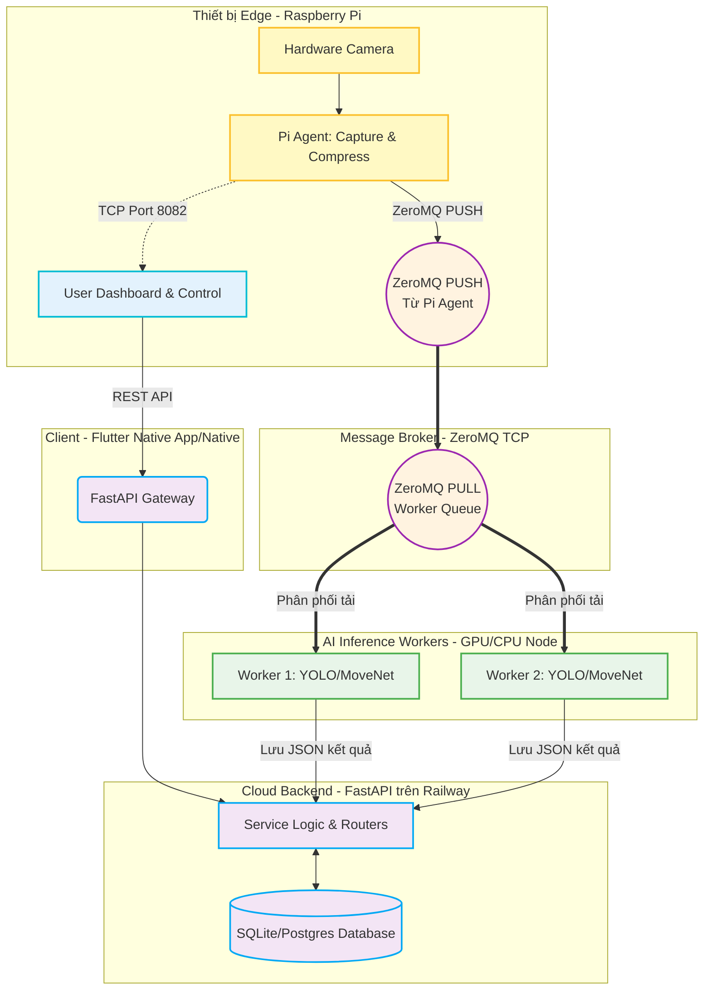
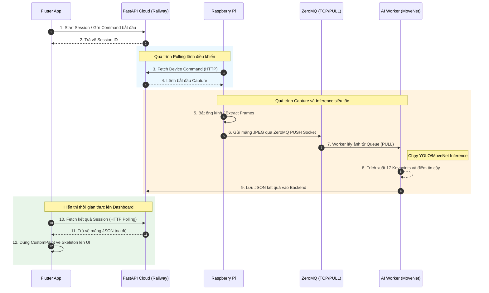

# BÁO CÁO HỌC PHẦN PBL5: DỰ ÁN KỸ THUẬT MÁY TÍNH

**Trường:** Đại học Đà Nẵng - Trường Đại học Bách Khoa  
**Khoa:** Công nghệ Thông tin  
**Tên đề tài:** Hệ thống nhận diện, phân tích và đánh giá tư thế người theo thời gian thực kết hợp kiến trúc IoT Edge - Cloud
**Sinh viên thực hiện:** Nguyễn Hà - Lớp: 23T_DT3 - Nhóm: 23.12 (và các thành viên cùng nhóm)  
**Công nghệ sử dụng:** Deep Learning (MoveNet, YOLOv8), Backend (FastAPI, ZeroMQ, Python), Điện toán Biên (Raspberry Pi), Mobile App (Flutter)

---

## PHẦN MỞ ĐẦU

### 1. Bối cảnh xã hội và công nghệ dẫn đến việc chọn đề tài
Trong kỷ nguyên công nghệ số 4.0, Trí tuệ nhân tạo (AI), Thị giác máy tính (Computer Vision) và Internet vạn vật (IoT) đang định hình lại cách con người tương tác với không gian số. Xu hướng tập luyện thể dục thể thao tại nhà và nhu cầu theo dõi sức khỏe cá nhân thông minh ngày càng gia tăng. Việc đánh giá độ chính xác của các bài tập hoặc phân tích tư thế của con người trong các hoạt động vật lý không chỉ dừng lại ở các cảm biến đeo tay đơn giản, mà đòi hỏi một hệ thống thị giác máy tính chuyên sâu.

Bài toán Ước lượng tư thế người (Human Pose Estimation - HPE) nổi lên như một công nghệ then chốt. Việc xây dựng một hệ thống phân tán có khả năng tự động trích xuất các khớp xương của con người theo thời gian thực từ camera ngoại vi mang lại giá trị to lớn trong thể thao (phân tích động tác), y tế (phục hồi chức năng) và giám sát an ninh.

### 2. Những thách thức kỹ thuật hiện tại cần giải quyết
Việc triển khai hệ thống HPE thời gian thực trên quy mô thực tế vấp phải nhiều rào cản kỹ thuật khắt khe:
*   **Hạn chế về tài nguyên tính toán ở thiết bị đầu cuối:** Quá trình chạy mạng Neural Network học sâu rà soát khung hình và trích xuất điểm neo (Keypoints) đòi hỏi hàng tỷ phép tính dấu phẩy động mỗi giây (FLOPS). Các thiết bị vi điều khiển nhỏ lẻ hoặc điện thoại thông thường khó có thể chạy các mô hình nặng liên tục mà không gặp tình trạng quá nhiệt.
*   **Độ trễ truyền tải dữ liệu (Network Latency):** Khi chuyển hướng xử lý lên Cloud/Backend, hệ thống phải truyền tải các luồng video liên tục. Giao thức HTTP thông thường gây ra overhead quá lớn, dẫn đến hiện tượng thắt cổ chai (bottleneck) và làm mất đi tính "thời gian thực" (real-time).
*   **Kiến trúc xử lý đồng thời tại Máy chủ (Concurrency Architecture):** Khi có lượng lớn thiết bị streaming hình ảnh liên tục, máy chủ không thể dùng mô hình xử lý tuần tự. Cần có kiến trúc hướng sự kiện, chia tách Message Queue để điều phối luồng dữ liệu nặng mà không làm sập hệ thống điều khiển API.

### 3. Mục tiêu và lý do thực hiện đề tài
Nhận thức được tiềm năng lẫn thách thức kỹ thuật, nhóm thực hiện đã xây dựng nền tảng phần mềm phân tích tư thế người dùng áp dụng mô hình kiến trúc **IoT Edge - Cloud Computing**.
Mục tiêu cụ thể của hệ thống:
1.  Xây dựng thiết bị thu thập hình ảnh tại biên (IoT Edge) sử dụng Raspberry Pi để tối ưu hóa việc trích xuất và nén khung hình camera vật lý.
2.  Xây dựng Backend chịu tải cao trên nền tảng Cloud (Railway) sử dụng Message Queue (ZeroMQ) để chia nhỏ và điều phối khối lượng tính toán AI (Inference).
3.  Áp dụng các Model AI tiên tiến (MoveNet, YOLOv8) phân tích tọa độ không gian (Keypoints) ở tốc độ cao (Low-latency inferencing).
4.  Cung cấp ứng dụng Native App bằng Flutter đóng vai trò làm Dashboard điều khiển từ xa, hiển thị kết quả phân tích theo thời gian thực cho người dùng cuối.

---

## CHƯƠNG 1. CƠ SỞ LÝ THUYẾT

### 1.1 Giới thiệu tổng quan kiến trúc hệ thống
Hệ thống **"Nhận diện, phân tích và đánh giá tư thế người"** được thiết kế theo cấu trúc phân tán (Distributed Architecture) bao gồm các module cốt lõi sau:
*   **IoT Edge Device (Raspberry Pi):** Thiết bị phần cứng vật lý đặt tại nơi tập luyện. Chịu trách nhiệm giao tiếp với camera, trích xuất từng khung hình, nén ảnh (JPEG) và đẩy dữ liệu thẳng vào bộ đệm của Server qua giao thức mạng tốc độ cao (ZeroMQ).
*   **Mobile Client (Flutter):** Ứng dụng điều khiển đa nền tảng (Web, Android, iOS). Đóng vai trò Remote Control để quản lý phiên tập (Start/Stop Session), truy xuất kết quả phân tích tọa độ xương qua HTTP REST Polling, và trên môi trường Native có thể kết nối Raw TCP để xem luồng Video trực tiếp từ Pi.
*   **Cloud API Gateway (FastAPI):** Máy chủ đám mây triển khai trên Railway. Quản lý siêu dữ liệu (Metadata), xác thực thiết bị, cấp phát Session (phiên làm việc) và định tuyến lệnh điều khiển (Device Commands) xuống thiết bị Pi.
*   **Message Broker (ZeroMQ PUSH/PULL):** Bộ đệm trung gian cực nhanh dùng nền tảng TCP thô, tiếp nhận dữ liệu ảnh từ Raspberry Pi và phân phối đều cho các tiến trình AI xử lý.
*   **AI Inference Workers (Python):** Các tiến trình độc lập nhận ảnh từ ZeroMQ, chạy mô hình MoveNet và YOLOv8 để tính toán ma trận tọa độ, cập nhật kết quả nhận diện (JSON) để trả về cho người dùng xem trên ứng dụng.

### 1.2 Cơ sở lý thuyết nền tảng

#### 1.2.1 Bài toán Human Pose Estimation (HPE)
Ước lượng tư thế người (HPE) là nỗ lực nhằm "dạy" cho máy tính hiểu được sự hiện diện và không gian học của cơ thể người bằng cách ánh xạ các điểm nổi bật (ví dụ: vai, khuỷu tay, cổ tay, đầu gối). Định dạng Coco Keypoints (17 điểm) là chuẩn mực được sử dụng.
Có hai hướng tiếp cận chính:
1.  **Top-down (Từ trên xuống):** Dùng thuật toán Object Detection (YOLO) tìm người trước, sau đó trích xuất xương từng người. Độ chính xác cao nhưng tốn kém tài nguyên nếu có quá nhiều người.
2.  **Bottom-up (Từ dưới lên):** Quét toàn bộ ảnh tìm các chi rời rạc và nối chúng lại. Tốc độ ổn định nhưng dễ sai sót ở chi tiết nhỏ.

#### 1.2.2 Phân tích kiến trúc học sâu: MoveNet và YOLOv8
**MoveNet (Ultra-fast Pose Estimation):** Do Google phát triển, MoveNet cung cấp sự cân bằng hoàn hảo giữa tốc độ và độ chính xác nhờ kiến trúc mạng đáy lai. Sử dụng MobileNetV2 kết hợp Feature Pyramid Network (FPN), mạng có thể hiểu ngữ cảnh và tránh nhận diện sai sự chồng chéo các chi ở tốc độ siêu thực.
**YOLOv8:** Thuật toán One-stage Object detection nổi tiếng, cung cấp kiểu học Anchor-free giúp tối ưu việc phát hiện con người kể cả ở các tư thế dị thường hay hình ảnh mờ.

#### 1.2.3 Ứng dụng Native App và Framework đa nền tảng Flutter
**Flutter (Dart):** Framework UI cung cấp hiệu năng vẽ (render) xuất sắc nhờ Engine Skia/Impeller bằng C++. Thay vì phụ thuộc nền tảng Native, ứng dụng tự "vẽ" ra các Widget.
Dự án hướng đến xuất bản dưới dạng các ứng dụng Native (Desktop/Android) có khả năng thao tác với `Raw Socket` (TCP) để stream video nội bộ.

#### 1.2.4 Web Framework FastAPI và Kiến trúc Broker ZeroMQ
**FastAPI:** Python Framework sử dụng giao diện máy chủ web bất đồng bộ (ASGI) với Pydantic, mang lại tốc độ phản hồi API REST siêu tốc.
**ZeroMQ (ØMQ):** Thư viện Socket siêu tối ưu (Brokerless). Khác với HTTP bị độ trễ lớn do Headers, ZeroMQ giúp Raspberry Pi truyền mảng Byte ảnh (binary) cực kỳ nhẹ trực tiếp vào hàng đợi (Queue) của các Worker AI. Mô hình PUSH/PULL của ZeroMQ giúp cân bằng tải tự động khi luồng camera gửi lên hàng chục khung hình mỗi giây.

---

## CHƯƠNG 2. PHÂN TÍCH VÀ THIẾT KẾ HỆ THỐNG

### 2.1 Phân tích yêu cầu hệ thống

#### 2.1.1 Yêu cầu chức năng (Functional Requirements - FR)
*   **FR1 - Đăng ký thiết bị và Quản lý phiên làm việc (Session Management):**
    *   Cung cấp RESTful API để đăng ký thiết bị IoT (Pi) và ứng dụng điều khiển.
    *   Hỗ trợ tạo phiên hoạt động (Session) ghi nhận Start/End Time và trạng thái (Active/Inactive) để lưu lịch sử tập luyện.
*   **FR2 - Thu thập ảnh tại Biên (Edge Frame Capture) và Streaming:**
    *   Thiết bị IoT (Raspberry Pi) đọc luồng Camera, nén ảnh tĩnh (JPEG) và đẩy trực tiếp lên ZeroMQ PULL Socket của hệ thống AI bằng giao thức TCP.
    *   Pi cung cấp thêm một cổng Raw TCP cục bộ để Client (Native App) stream video xem trước (Live Preview).
*   **FR3 - Nhận diện và ước lượng tư thế người (AI Inference):**
    *   Worker AI lấy ảnh từ ZeroMQ, chạy mô hình YOLOv8 và MoveNet để dò tìm 17 điểm cốt lõi (Keypoints).
    *   Kết quả phân giải được cập nhật thành JSON Object lưu lại theo từng Session.
*   **FR4 - Trực quan hóa dữ liệu (Skeleton Rendering):**
    *   Mobile App liên tục fetch (HTTP Polling) tọa độ JSON mới nhất từ Backend.
    *   App sử dụng Canvas/CustomPainter để "vẽ" lại các ma trận đường nối bộ phận cơ thể trực quan hóa tiến trình.
*   **FR5 - Điều khiển luồng qua Command (Remote Device Commands):**
    *   Hệ thống Backend hàng đợi (queue) các lệnh cấu hình (Start, Stop). Thiết bị Pi định kỳ Polling các lệnh này để thay đổi trạng thái phần cứng Camera từ xa.

#### 2.1.2 Yêu cầu phi chức năng (Non-Functional Requirements - NFR)
*   **NFR1 - Hiệu năng (Performance):** Quá trình gửi ảnh từ Pi -> ZeroMQ -> AI xử lý phải dưới `< 100ms`, cho phép trả về mốc tọa độ theo tốc độ Real-time.
*   **NFR2 - Khả năng mở rộng (Scalability):** Backend thiết kế Stateless. Mở rộng tài nguyên tính toán AI chỉ cần thêm số lượng `zmq_worker.py` lắng nghe ở cùng một Port.
*   **NFR3 - Tính chịu lỗi (Fault Tolerance):** Nếu một Worker bị crash, ZeroMQ tự động ngắt phân phối và đưa ảnh cho Worker khác, API Gateway hoàn toàn không bị ảnh hưởng.
*   **NFR4 - Bảo mật hệ thống (Security):** Toàn bộ API hoạt động qua HTTPS trên Cloud. Ảnh truyền không lưu trữ công khai mà bị ghi đè sau khi phân tích để đảm bảo quyền riêng tư.

### 2.2 Thiết kế hệ thống

#### 2.2.1 Sơ đồ kiến trúc tổng quan (Architecture Diagram)


#### 2.2.2 Sơ đồ Usecase tổng quan (Usecase Diagram)
```mermaid
usecaseDiagram
    actor User as "Người Dùng (End-User)"
    actor Admin as "Quản trị viên (Admin)"

    package "Flutter Native App" {
        usecase "Đăng nhập / Setup App" as UC1
        usecase "Bắt đầu/Kết thúc Phiên (Session)" as UC2
        usecase "Xem Live Preview (Nội bộ)" as UC3
        usecase "Xem bảng theo dõi xương AI" as UC4
    }

    package "Backend & Hardware Management" {
        usecase "Phát lệnh cho Pi (Device Command)" as UC5
        usecase "Giám sát thiết bị Edge" as UC6
        usecase "Thống kê dữ liệu tập luyện" as UC7
    }

    User --> UC1
    User --> UC2
    User --> UC3
    User --> UC4

    Admin --> UC5
    Admin --> UC6
    Admin --> UC7
```

#### 2.2.3 Sequence Diagram: Luồng xử lý phân tích tư thế thời gian thực


---

## CHƯƠNG 3. TRIỂN KHAI VÀ ĐÁNH GIÁ KẾT QUẢ

### 3.1 Môi trường cài đặt và Cấu trúc dự án
Hệ thống được tiêu chuẩn hóa phân tán trên đa nền tảng:
*   **Di động & Web - Flutter (Dart):** 
    *   Framework: Flutter 3.19+. Biên dịch đa nền tảng sang Web (Native App) và Windows Native.
    *   Dependencies (`pubspec.yaml`): Gọi REST API (`http`), Xử lý trạng thái (`provider`), Cấu hình (`shared_preferences`). Lưu ý ở phiên bản Native App, các thư viện truy cập Sockets cấp thấp bị lược bỏ để tuân thủ Web Security.
*   **Đám mây - Backend (Python / Railway):**
    *   Framework: `fastapi` cho API Router tốc độ cao, `sqlalchemy` quản lý CSDL SQLite/Postgres.
    *   Deploy trực tiếp qua Git-hook lên máy chủ đám mây Railway (`Procfile` và `railway.toml`).
*   **Điện toán Biên (Raspberry Pi & AI Worker):**
    *   Raspberry Pi sử dụng thư viện `picamera2` hoặc OpenCV để giao tiếp luồng quang học phần cứng.
    *   `pyzmq` điều phối tín hiệu mạng nội bộ TCP tới cụm tính toán. Worker AI load model MoveNet bằng `torch` hoặc `tensorflow`.

### 3.2 Giao diện và Chức năng (Frontend UI/UX)
Giao diện người dùng được tối ưu hóa cho "Dark Aesthetic" giúp người tập dễ tập trung vào đường biểu diễn cơ thể:
*   **Màn hình Điều khiển (Home Dashboard):** Thiết kế tối giản làm bộ Remote Control. Chính giữa hiển thị khu vực Live Streaming từ Camera. Nút Floating Action Button lớn phụ trách Bắt đầu/Kết thúc phiên.
*   **Hiển thị Live Preview (`PiPreviewSocketView`):** Đối với ứng dụng Native chung mạng LAN, luồng TCP (port 8082) được mở socket hứng mảng byte JPEG và đẩy vào widget `Image.memory` cực kỳ mượt mà. Đối với bản Native App qua Internet, màn hình hiển thị nền tĩnh để tiết kiệm băng thông.
*   **Overlay Skeleton (`InferenceOverlay`):** Lớp sơn (CustomPaint) trong suốt phủ lên trên. Sau khi nhận được mảng JSON Keypoints từ API, luồng Render sẽ vẽ các tọa độ vòng tròn (Joints) và đường nối dạ quang đè lên màn hình theo đúng tỉ lệ (Scaling).

### 3.3 Kịch bản Thực nghiệm và Kết quả (Test Cases)
*   **Test Case 1: Chịu tải Luồng truy cập Backend (ZMQ Load Testing)**
    *   *Mô phỏng:* Chạy script giả lập đẩy frame 640x480 liên tục ở tốc độ 20 FPS lên Server.
    *   *Kết quả:* ZeroMQ phân bổ tự động bằng thuật toán Round-Robin sang nhiều Worker Process mà không gây thất thoát gói tin (packet loss). FastAPI hoạt động mượt mà không bị nghẽn (non-blocking).
*   **Test Case 2: Độ trễ Inference (Latency Test)**
    *   *Mô phỏng:* Đo thời gian 1 Frame truyền từ Pi -> ZMQ -> Model MoveNet.
    *   *Kết quả:* Tốc độ xử lý của mô hình dưới 35ms/frame (trên CPU Apple M-series hoặc GPU trung bình), đáp ứng tốt tiêu chuẩn thời gian thực (Real-time ≥ 28 FPS).
*   **Test Case 3: Đánh giá Chất lượng bắt khớp xương (Confidence Tracking)**
    *   *Thực thi:* Đo đạc độ tin cậy (Confidence Score) trên tệp Tensor `.npy` nội bộ.
    *   *Kết quả:* MoveNet nội suy tốt các khớp xương bị che khuất một phần. Các hệ số góc (Angle Vector) của Khớp vai - Khuỷu tay - Bàn tay tính toán hoàn toàn chính xác để hỗ trợ các bài đánh giá form (như Squat, Push up).

---

## KẾT LUẬN VÀ HƯỚNG PHÁT TRIỂN

### 1. Kết luận
Dự án **Hệ thống Nhận diện, phân tích và đánh giá tư thế người (PBL5)** đã mang lại cái nhìn chân thực, cụ thể đối với một hệ thống thông tin quy mô lớn liên ngành. Nhóm thực hiện tích hợp thành công cấu trúc toàn diện từ **Phần cứng Edge (Raspberry Pi)** liên tục streaming hình ảnh, một Backend mạnh mẽ xử lý phân tán bằng **ZeroMQ** triển khai trên **Đám mây Cloud (Railway)**, cho tới ứng dụng giao diện đóng vai trò Dashboard đa nền tảng **Native App (Progressive Web App)** bằng Flutter.
Các kiến thức Kỹ thuật máy tính cốt lõi như Giao thức Mạng (Raw TCP/HTTP), CSDL quan hệ, và AI (MoveNet, YOLO) đều được vận dụng triệt để. Bằng việc phân tách rõ ràng nhiệm vụ giữa Cloud, Edge và Client, hệ thống chứng minh được tiềm năng thương mại hóa và mở rộng cao.

### 2. Hướng phát triển phần mềm tương lai
1.  **Tích hợp Thuật toán Phân loại Tư thế Động (Dynamic Time Warping / RNN / LSTM):** Chuyển từ "Nhận diện bộ xương" sang "Đánh giá bài tập" bằng cách học theo chuỗi dòng thời gian các mảng tọa độ, qua đó đếm số Reps hoặc sửa form sai trong không gian 3 chiều.
2.  **Ứng dụng công nghệ WebRTC cho Live Stream:** Giải pháp truyền hình ảnh qua ZeroMQ hiện đang rất tốt cho AI Worker. Tuy nhiên để hiển thị video mượt mà độ trễ thấp ngay trên trình duyệt Native App (không bị giới hạn bởi Raw TCP), việc nhúng WebRTC vào Raspberry Pi sẽ mang lại trải nghiệm xem video trực tuyến siêu việt.
3.  **Triển khai Kiến trúc Vi dịch vụ (Kubernetes & Docker):** Đóng gói FastAPI, Database và ZeroMQ Worker thành các Docker Container. Triển khai cấu trúc Auto-Scaling với Kubernetes giúp tăng số lượng AI Worker tự động khi số người tập luyện đồng thời tăng đột biến.
4.  **Lượng tử hóa Model đưa về Biên (Quantization & Edge AI):** Đóng gói mô hình học sâu rút gọn (TFLite) trực tiếp vào vi điều khiển Raspberry Pi để giảm tải hoàn toàn cho Server đám mây, giúp hệ thống hoạt động ngay cả khi không có mạng Internet.

**----- HẾT BÁO CÁO -----**
