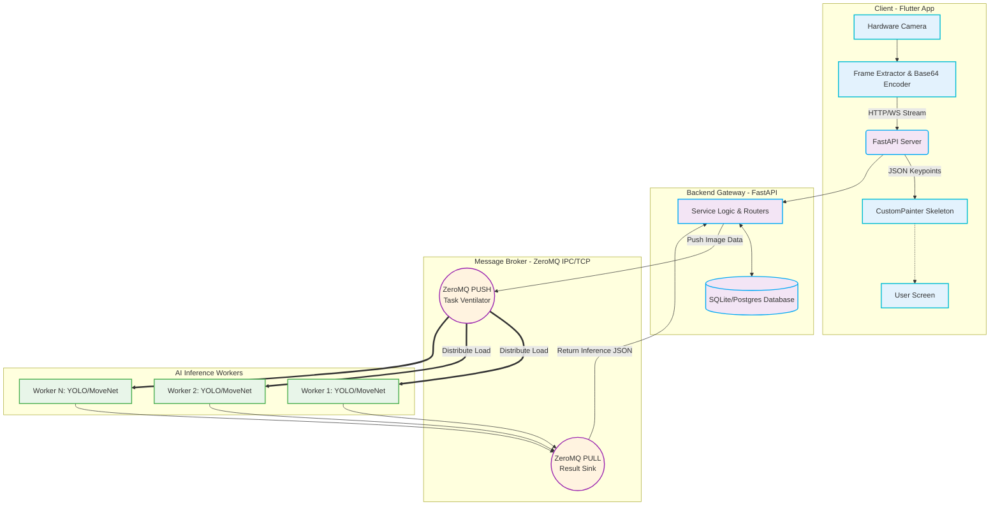
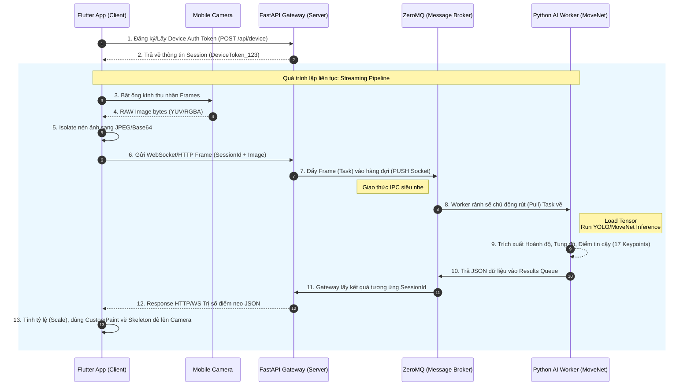

# BÁO CÁO HỌC PHẦN PBL5: DỰ ÁN KỸ THUẬT MÁY TÍNH

**Trường:** Đại học Đà Nẵng - Trường Đại học Bách Khoa  
**Khoa:** Công nghệ Thông tin  
**Tên đề tài:** Hệ thống nhận diện, phân tích và đánh giá tư thế người theo thời gian thực (Real-time Human Pose Estimation System)  
**Sinh viên thực hiện:** Nguyễn Hà - Lớp: 23T_DT3 - Nhóm: 23.12 (và các thành viên cùng nhóm)  
**Công nghệ sử dụng:** Deep Learning (MoveNet, YOLOv8), Backend (FastAPI, ZeroMQ, Python), Mobile App (Flutter, Dart)

---

## PHẦN MỞ ĐẦU

### 1. Bối cảnh xã hội và công nghệ dẫn đến việc chọn đề tài
Trong kỷ nguyên công nghệ số 4.0, Trí tuệ nhân tạo (AI) và Thị giác máy tính (Computer Vision) đang thay đổi cách con người tương tác với không gian số. Đặc biệt, sau những tác động của đại dịch toàn cầu, xu hướng tập luyện thể dục thể thao tại nhà và nhu cầu theo dõi sức khỏe cá nhân đã tăng vọt. Mọi người ngày càng quan tâm đến việc sử dụng các thiết bị thông minh để hỗ trợ giám sát sức khỏe, từ việc đếm số bước chân đến đo nhịp tim. Tuy nhiên, việc đánh giá độ chính xác của các bài tập phức tạp hoặc phân tích thái độ, tư thế của con người trong các hoạt động vật lý đòi hỏi một công nghệ chuyên sâu hơn.

Bài toán Ước lượng tư thế người (Human Pose Estimation - HPE) nổi lên như một công nghệ then chốt. Nó không chỉ ứng dụng trong thể thao (phân tích swing trong golf, tư thế tập yoga, gym) mà còn có giá trị to lớn trong y tế (vật lý trị liệu, phục hồi chức năng), giám sát an ninh và tương tác người-máy (HCI). Việc xây dựng một hệ thống có khả năng tự động trích xuất các khớp xương của con người theo thời gian thực từ video/camera thiết bị di động mang lại giá trị thực tiễn vô cùng to lớn.

### 2. Những thách thức kỹ thuật hiện tại cần giải quyết
Việc triển khai hệ thống HPE thời gian thực trên quy mô thực tế vấp phải nhiều rào cản kỹ thuật khắt khe:
*   **Hạn chế về tài nguyên tính toán ở thiết bị đầu cuối:** Quá trình mạng Neural Network học sâu rà soát khung hình và trích xuất điểm neo (Keypoints) đòi hỏi hàng tỷ phép tính dấu phẩy động mỗi giây (FLOPS). Đa số thiết bị di động thông thường khó có thể chạy các mô hình nặng (như HRNet, OpenPose) ở mức khung hình cao (30-60 FPS) mà không gặp tình trạng quá nhiệt và hao pin nhanh chóng.
*   **Độ trễ truyền tải dữ liệu (Network Latency):** Khi chuyển hướng xử lý lên Cloud/Backend, hệ thống phải truyền tải các luồng video liên tục. Giao thức HTTP thông thường gây ra overhead quá lớn, dẫn đến hiện tượng bottleneck (thắt cổ chai) và giật lag, làm mất đi tính "thời gian thực" (real-time).
*   **Kiến trúc xử lý đồng thời tại Máy chủ (Concurrency Architecture):** Khi có hàng trăm, ngàn người dùng streaming video cùng lúc, máy chủ Backend không thể dùng mô hình xử lý tuần tự (Synchronous). Đòi hỏi một kiến trúc hướng sự kiện (Event-driven), bất đồng bộ (Asynchronous) và phân tán các tác vụ AI (AI Workers) nhằm điều phối luồng dữ liệu nặng liên tục mà không làm crash hệ thống.

### 3. Mục tiêu và lý do thực hiện đề tài
Nhận thức được tiềm năng tính ứng dụng lẫn các thách thức về mặt hệ thống, nhóm thực hiện đã lựa chọn đề tài xây dựng nền tảng phần mềm phân tích tư thế người dùng với mô hình học sâu áp dụng cho cả Mobile App và Cloud Computing.
Mục tiêu cụ thể của hệ thống:
1.  Thu thập và hiển thị luồng video người dùng qua một Mobile App đa nền tảng tối ưu hiệu năng.
2.  Xây dựng Backend chịu tải cao, sử dụng Message Queue để chia nhỏ khối lượng tính toán AI (Inference) từ các camera stream.
3.  Áp dụng và tinh chỉnh các Model AI tiên tiến (MoveNet, YOLO) nhằm nhận dạng đối tượng con người và xuất ra tọa độ hình học không gian (Keypoints) ở tốc độ cao nhất (Low-latency inferencing).
4.  Lưu trữ lịch sử, theo dõi phiên hoạt động và trả về các chỉ số phân tích trực quan cho người dùng cuối.

---

## CHƯƠNG 1. CƠ SỞ LÝ THUYẾT

### 1.1 Giới thiệu tổng quan hệ thống và các thành phần cốt lõi
Hệ thống **"Nhận diện, phân tích và đánh giá tư thế người theo thời gian thực"** là một cấu trúc phân tán (Distributed Architecture) bao gồm các module chính liên kết lỏng lẻo (Loosely coupled) với nhau:
*   **Mobile Client (Flutter):** Chịu trách nhiệm trực tiếp giao tiếp với camera phần cứng, nén khung hình ở định dạng tối ưu và giao tiếp với máy chủ thông qua kênh kết nối song công (như WebSockets hoặc Raw Sockets) nhằm giảm overhead.
*   **API Gateway (FastAPI):** Lớp bảo vệ và giao tiếp mạng, tiếp nhận dữ liệu từ các thiết bị di động, cấp phát Session (phiên làm việc) và định tuyến dữ liệu.
*   **Message Broker cơ chế IPC/TCP (ZeroMQ):** Bộ đệm trung gian xử lý lượng lớn throughput, đẩy dữ liệu thô (raw images) vào các hàng đợi của các AI Worker một cách công bằng (Fair-queueing).
*   **AI Inference Workers (Python & PyTorch/TensorFlow):** Các tiến trình riêng biệt làm nhiệm vụ nhận ảnh từ ZeroMQ, chạy mô hình MoveNet và YOLOv8 để tính toán ma trận tọa độ, sau đó gửi kết quả hồi đáp lại Gateway để trả về Client.

### 1.2 Cơ sở lý thuyết nền tảng

#### 1.2.1 Bài toán Human Pose Estimation (HPE)
**Khái niệm và Nguyên lý:**
Ước lượng tư thế người (HPE) là nỗ lực của khoa học máy tính nhằm "dạy" cho máy thị giác hiểu được sự hiện diện và tư thế học không gian của cơ thể người. Kỹ thuật này thường mô phỏng bộ khung xương vật lý bằng cách ánh xạ các điểm nổi bật (ví dụ: mũi, mắt, tai, vai, khuỷu tay, cổ tay, hông, đầu gối, mắt cá chân). Một mô hình chuẩn thường dùng là định dạng Coco Keypoints (17 điểm).

**Hai hướng tiếp cận chính:**
1.  **Top-down (Từ trên xuống):** Quy trình gồm 2 bước. Bước 1: Thuật toán Object Detection (như YOLO, Faster R-CNN) sẽ tìm tất cả hộp giới hạn (Bounding box) chứa con người. Bước 2: Mỗi Bounding box được crop ra và đưa vào một mạng CNN khác để dự đoán độc lập tọa độ các điểm. 
    *   *Ưu điểm:* Độ chính xác cực kỳ cao do mô hình tập trung vào việc ước lượng từng người rõ ràng.
    *   *Nhược điểm:* Độ phức tạp thuật toán và thời gian tính toán tăng tỷ lệ thuận với số lượng người $O(N)$.
2.  **Bottom-up (Từ dưới lên):** Mạng nơ-ron thực hiện quét toàn bộ ảnh một lần duy nhất, phát hiện ra tất cả các "bàn tay", "bàn chân", "đầu" có trong bức ảnh bằng cách tạo ra các Heatmap (Bản đồ nhiệt). Tiếp đó, hệ thống dùng thuật toán (ví dụ Part Affinity Fields - PAFs) để "nối" các tay, chân, đầu lại thành các cá thể riêng biệt.
    *   *Ưu điểm:* Tốc độ khung hình (FPS) ổn định không kể số người có trong hình, thời gian xử lý giữ mức $O(1)$.
    *   *Nhược điểm:* Đòi hỏi tài nguyên RAM/VRAM khá lớn và độ chính xác thường thấp hơn Top-down đối với các nhân vật nhỏ ở xa.

#### 1.2.2 Phân tích kiến trúc học sâu: MoveNet và YOLOv8
**MoveNet (Ultra-fast Pose Estimation):**
Được kiến trúc bởi đội ngũ Google, MoveNet cung cấp sự cân bằng hoàn hảo giữa thông lượng xử lý nhanh và độ chính xác cao nhờ kiến trúc mạng đáy lai (hybrid bottom-up & top-down).
*   **Kiến trúc trích xuất đặc trưng (Backbone):** MoveNet tận dụng mạng MobileNetV2 - sử dụng Depthwise Separable Convolutions giúp giảm thiểu số lượng parameter cần thiết để tính toán xuống hàng chục lần so với Convolution truyền thống. Kết hợp với Feature Pyramid Network (FPN), mạng có thể hiểu được ngữ cảnh lớn của bức ảnh để tránh nhận diện sai sự chồng chéo các chi.
*   **Đầu ra (Detection head):** Áp dụng kỹ thuật CenterNet, MoveNet dự đoán trung tâm trọng lực của con người, sau đó từ tâm nội suy ra vector tịnh tiến (Offset vector) đến 17 tọa độ điểm khớp. Tính chất này loại bỏ hoàn toàn quá trình Non-Maximum Suppression (NMS) phức tạp.

**YOLOv8 (You Only Look Once phiên bản 8):**
YOLO là họ mô hình One-stage Object detection nổi tiếng nhất thế giới.
*   Trong các module cần phân vùng (segment, detect) trước ở Backend, YOLOv8 cung cấp kiểu học Anchor-free (không phụ thuộc hộp neo định sẵn), tối ưu hóa rất tốt hàm mất mát (Loss function) DFL (Distribution Focal Loss) và CIoU, đem lại độ tin cậy vượt bậc đối với phát hiện người, kể cả ở các tư thế dị thường hay hình ảnh bị mờ nhoè.

#### 1.2.3 Framework đa nền tảng Flutter và Mô hình Isolate
**Kiến trúc Skia/Impeller Rendering Engine:**
Không giống như React Native (dùng JavaScript Bridge biên dịch ở runtime để thao tác các thẻ View Native), Flutter mang vào ứng dụng một Graphic Engine riêng rẽ. Nó sơn (paint) từng pixel trên màn hình trực tiếp bằng C++. Điều này loại bỏ hoàn toàn "độ trễ giao tiếp" (Bridge barrier latency) và đảm bảo các Frame render mượt mà ở tần số 60Hz - 120Hz.

**Mô hình luồng (Threading) và Dart Isolate:**
Dart (ngôn ngữ nền tảng của Flutter) mặc định chạy trên một Thread duy nhất (Thread chính - UI Thread) qua một Event Loop. Để thực hiện các tác vụ siêu nặng (như nén khung hình camera từ chuẩn YUV420 sang JPEG hoặc mã hóa WebSocket frame), nhóm sử dụng khái niệm **Isolate**. Isolate là những luồng độc lập, không chia sẻ bộ nhớ (Memory Sharing), giao tiếp với nhau qua các Message Port. Áp dụng cơ chế này giúp UI của ứng dụng Camera hoàn toàn không bị đứng (freeze) khi hệ thống liên tục gửi cả vài chục khung hình mỗi giây lên server.

#### 1.2.4 Web Framework FastAPI và Kiến trúc Message Broker ZeroMQ
**FastAPI và ASGI:**
FastAPI được sử dụng cốt lõi ở `backend/app/main.py`. Nó là một trong những Python Framework nhanh nhất hiện nay nhờ kế thừa nền tảng Starlette và sử dụng giao diện máy chủ web bất đồng bộ (ASGI). Sự kết hợp với lớp xác thực Pydantic giúp tự động parse JSON, validate type của request ở tốc độ C (nhúng thư viện Rust dưới nền).

**ZeroMQ - "Brokerless" Message Queueing:**
Khác với sự cồng kềnh của RabbitMQ hay Kafka, vốn là các ứng dụng độc lập cần cấu hình cluster và lưu dữ liệu trên ổ cứng, ZeroMQ (ØMQ) là một thư viện Socket siêu tối ưu.
*   Trong dự án, Gateway (FastAPI) đóng vai trò là một tiến trình đệm, nó không trực tiếp chạy mạng AI (gây blocking event loop).
*   FastAPI sẽ ném các khung hình raw vào một Socket dạng **PUSH** của ZeroMQ thông qua giao thức truyền thông liên tiến trình (IPC - Inter-process Communication).
*   Nhiều tiến trình `zmq_worker.py` (Worker processes) sẽ hoạt động như các **PULL** socket, tranh nhau lấy ảnh (nhờ thuật toán Round-Robin hoặc Fair Queuing của ZeroMQ) và tính toán qua GPU/CPU.
*   Mô hình này giúp xử lý tình trạng hàng nghìn request đến cùng một lúc bằng cách mở rộng quy mô worker theo chiều ngang (Scale Out) trên cùng một máy chủ vật lý, hoặc phân tán ra đa máy chủ vật lý nếu thay IPC thành kết nối TCP.

---

## CHƯƠNG 2. PHÂN TÍCH VÀ THIẾT KẾ HỆ THỐNG

### 2.1 Phân tích yêu cầu hệ thống

#### 2.1.1 Giới thiệu chung
Phân tích yêu cầu là giai đoạn mang tính quyết định trong vòng đời phát triển phần mềm (SDLC). Đối với một hệ thống đòi hỏi tốc độ xử lý nhanh, khả năng chịu tải tốt và độ chính xác cao từ AI như hệ thống Ước lượng tư thế người, việc nắm bắt và định lượng hóa các yêu cầu trở nên đặc biệt khắt khe. Hệ thống phải đảm bảo nhiệm vụ tiếp nhận hình ảnh liên tục từ thiết bị phần cứng của người dùng (như camera điện thoại), mã hóa khối dữ liệu, thiết lập một kết nối xuyên suốt với Backend, và ngay lập tức phân giải kết quả thành luồng hiển thị giao diện đồ họa. Quá trình thiết kế được chia làm hai mảng chính: Yêu cầu chức năng (những gì hệ thống phải làm) và Yêu cầu phi chức năng (hệ thống làm điều đó tốt như thế nào).

#### 2.1.2 Yêu cầu chức năng (Functional Requirements - FR)
Căn cứ vào mục tiêu ban đầu, hệ thống được đặc tả với các chức năng cốt lõi sau:

*   **FR1 - Đăng ký thiết bị và Quản lý phiên làm việc (Session Management):**
    *   Hệ thống cần cung cấp các RESTful API (`/api/routes/...`) để ứng dụng di động tự động đăng ký định danh thiết bị (Device ID/Token) mỗi khi khởi động.
    *   Hệ thống cho phép khởi tạo một phiên phân tích mới (Session). Mỗi phiên sẽ ghi nhận thời điểm bắt đầu (Start Time), thời điểm kết thúc (End Time) và trạng thái (Active/Inactive), giúp ứng dụng dễ dàng lưu trữ lại lịch sử tập luyện.
*   **FR2 - Truyền tải dữ liệu ảnh (Frame Streaming):**
    *   Client (Flutter App) có khả năng đọc luồng từ phần cứng Camera (Front/Rear), trích xuất từng Frame hình ảnh ở một tần số nhất định (ví dụ 15 - 30 frame/giây).
    *   Client thực hiện nén ảnh tĩnh (JPEG nén ở mức 70-80% để tối ưu băng thông) và mã hóa Base64 trước khi đẩy lên Backend Gateway thông qua kết nối Socket hoặc luồng dữ liệu hai chiều.
*   **FR3 - Nhận diện và ước lượng tư thế người (AI Inference):**
    *   Hệ thống Backend có khả năng bóc tách luồng frame nhận được từ các thiết bị và điều phối chung (Routing) cho nhóm Worker AI.
    *   Worker thực thi mô hình YOLOv8 để xác định (Detection) người trong vùng tối và MoveNet để dò tìm 17 điểm cốt lõi (Keypoints) trên mỗi cơ thể một cách độc lập và song song.
    *   Kết quả phân giải được tổng hợp ở dạng một JSON Object (danh sách Keypoints chứa hoành độ X, tung độ Y và điểm tin cậy Score độ chính xác).
*   **FR4 - Trực quan hóa dữ liệu và Vẽ bộ xương (Skeleton Rendering):**
    *   Sau quá trình Inferencing, hệ thống di động nhận lại tọa độ JSON. Dựa trên tỷ lệ độ phân giải thiết bị thực tế, App sẽ tính toán nội suy ngược và sử dụng Canvas/CustomPainter để "vẽ" lại các ma trận đường line nối các bộ phận cơ thể (như vai, gối, mắt cá) chồng lên luồng Camera thực.
*   **FR5 - Điều khiển luồng qua Command (Device Commands):**
    *   Hệ thống cho phép quản trị viên hoặc server tự định nghĩa lệnh (Command: `start_session`, `stop_session`, `ping`) cấu hình thời gian thực xuống Client, lưu tại bảng `device_command`. Khi Device gửi tín hiệu heartbeat (Ping), Backend có thể trả về các command này để ép ứng dụng dừng tập hoặc thay đổi độ phân giải Camera từ xa.

#### 2.1.3 Yêu cầu phi chức năng (Non-Functional Requirements - NFR)
Bất kỳ kiến trúc phân tán kết hợp Deep Learning nào cũng đều có chi phí máy chủ và độ rủi ro hệ thống cao. Do đó, các NFR sau đây luôn phải được áp dụng định lượng nghiêm ngặt:

*   **NFR1 - Hiệu năng (Performance) và Độ trễ (Latency):**
    *   Tổng thời gian trễ từ lúc ảnh được gửi từ Mobile App đến khi kết quả được vẽ lên màn hình phải đạt `< 100ms - 150ms`.
    *   Hệ thống backend phải tối ưu Worker, có khả năng inference một bức ảnh qua mô hình MoveNet dưới `30ms` trên phần cứng tương đương CPU hạng trung hoặc GPU trung bình.
*   **NFR2 - Khả năng chịu tải và Mở rộng (Scalability):**
    *   Backend phải thiết kế theo kiến trúc phi trạng thái (Stateless). Nếu thêm thiết bị mobile sử dụng, kỹ sư chỉ việc gắn thêm Worker chạy file `zmq_worker.py` thay vì phải đập bỏ mã nguồn.
    *   Message Broker phải có tính năng "Buffering" - tức là khi có hàng chục Request đổ về cùng lúc, Gateway không chết mà sẽ đưa vào hàng đợi TCP Queue.
*   **NFR3 - Tính sẵn sàng, phục hồi (Availability & Fault Tolerance):**
    *   Nếu một Worker xử lý AI bị quá nhiệt thiết bị (out of memory/crash) do rò rỉ VRAM TensorFlow/PyTorch, Backend Gateway (FastAPI) dứt khoát không được bị sập theo. Nó sẽ tự động định tuyến lại Frame ảnh chưa xử lý sang Worker khác đang rảnh.
*   **NFR4 - Bảo mật hệ thống (Security):**
    *   Dữ liệu truyền tải là hình ảnh người dùng thực địa, do đó mọi traffic cần đi qua HTTPS/WSS (TLS/SSL encryption).
    *   Các Frame gửi từ người dùng không được lưu cứng lên ổ đĩa máy chủ (ngoại trừ chế độ debug `inspect_npy`) để đảm bảo các yếu tố quyền riêng tư (Privacy).

### 2.2 Thiết kế hệ thống

#### 2.2.1 Sơ đồ kiến trúc tổng quan (Architecture Diagram)
Hệ thống sử dụng kiến trúc Microservices-oriented kết hợp mô hình Pub-Sub của Message Broker. Sơ đồ bên dưới trình bày dòng chảy luân chuyển dữ liệu ở cấp độ Server.


*Giải thích:* Flutter client liên tục bắn dữ liệu Base64 lên Server thông qua API Gateway. Tại đây, Gateway tiếp tục ném khung ảnh này vào một ZeroMQ PUSH socket (như một cái phễu xả nước, gọi là pattern Ventilator). Các Worker nằm chờ dưới đáy phễu sẽ hút tuần tự từng ảnh một ra xử lý. Sau khi Inference chạy xong MoveNet tạo ra array các số float (17 keypoints), json data được đẩy vào PULL socket trả ngược lại qua Gateway, và cuối cùng Response luồng về Mobile cho người dùng. Nhờ thiết kế này, Gateway tách hoàn toàn khỏi luồng thực thi Neural Network rất dài và nặng.

#### 2.2.2 Sơ đồ Usecase tổng quan (Usecase Diagram)

```mermaid
usecaseDiagram
    actor User as "Người Dùng (End-User)"
    actor Admin as "Quản trị viên (Admin)"

    package "Mobile App System" {
        usecase "Khởi tạo Device Setup" as UC1
        usecase "Bắt đầu/Kết thúc Phiên (Session)" as UC2
        usecase "Cấp phép Camera" as UC3
        usecase "Stream Video & Xem tư thế" as UC4
        usecase "Thay đổi Setting (Độ phân giải, Cam xoay)" as UC5
    }

    package "Backend Management" {
        usecase "Phát lệnh cho thiết bị (Device Command)" as UC6
        usecase "Giám sát hiệu suất Worker" as UC7
        usecase "Cập nhật Model AI (Weights)" as UC8
        usecase "Thống kê dữ liệu tập luyện" as UC9
    }

    User --> UC1
    User --> UC2
    User --> UC3
    User --> UC4
    User --> UC5

    Admin --> UC6
    Admin --> UC7
    Admin --> UC8
    Admin --> UC9
    
    UC4 .> UC2 : <<include>>
    UC6 .> UC5 : <<extend>>
```

**Mô tả cụ thể Use Case "Stream Video & Xem tư thế" (UC4):**
*   *Tác nhân chính:* Người dùng.
*   *Tiền điều kiện:* Người dùng đã đăng ký Device, cài đặt App (`UC1`) và đã cấp quyền truy cập Camera (`UC3`).
*   *Chuỗi sự kiện cơ bản:* Người dùng nhấn "Bắt đầu". App chuyển sang giao diện toàn màn hình hiển thị trực tiếp luồng thu từ Camera. Các luồng khung hình được xử lý logic nền và gửi ngầm lên Server. Người dùng sẽ nhìn thấy kết quả phản hồi của Server được hiển thị bằng các đường vẽ nối trên khung hình thực trong vài phần nghìn giây. Hệ thống chấm điểm (nếu có các bài phân tích đánh giá tư thế mẫu) sẽ phát âm báo và gợi ý tư thế.

#### 2.2.3 Sequence Diagram: Luồng xử lý phân tích tư thế thời gian thực
Sơ đồ trình tự (Sequence) dưới đây phác thảo dòng đời sống của một khung hình (One Single Frame) đi từ thiết bị vật lý qua các tầng bảo vệ cho tới khi có một suy luận hợp lệ.



### 2.3 Môi trường cài đặt và cấu hình

#### 2.3.1 Môi trường lập trình (Development Environment)
Dự án được xây dựng và tiêu chuẩn hóa trên đa nền tảng, cho phép sự linh hoạt lớn nhất với các stack công nghệ sau:
*   **Môi trường hệ điều hành lập trình:** Nhóm định tuyến chuẩn OS trên là macOS/Linux Kernel cho chạy backend (môi trường sản xuất), và Windows/macOS cho việc build App (Android, iOS).
*   **Di động - Flutter (Dart):**
    *   Framework phiên bản: Flutter 3.19.x (hoặc mới nhất). Dart SDK: >= 3.2.0.
    *   IDE chủ đạo: Visual Studio Code tích hợp tiện ích Flutter, hoặc Android Studio.
    *   Tiện ích lõi (Dependencies - file `pubspec.yaml`): Camera plugin (`camera`), WebSocket plugin (`web_socket_channel`), Giao tiếp REST (`http` / `dio`), Xử lý trạng thái UI (`provider` / `riverpod`).
*   **Hệ thống Máy chủ (Backend):**
    *   Ngôn ngữ: Python 3.10 trở lên.
    *   IDE: Visual Studio Code.
    *   Framework phụ trợ (nằm ở file `requirements.txt`): `fastapi` (API Engine), `uvicorn` (ASGI web server), `pyzmq` (Thư viện build wrapper cho ZeroMQ C++), `sqlalchemy` (ORM database query), `pydantic` (Data Validator).
*   **Hệ thống Lõi Trí tuệ AI (Core Model):**
    *   Dependencies (`core_model/requirements.txt`): Thư viện Tensor tính toán `numpy`, thị giác cơ bản OpenCV (`opencv-python`), Deep learning framework `torch` (PyTorch) hoặc `tensorflow` để host weights YOLOv8, MoveNet.
    *   Cấu hình Tensor Inference: Tối ưu với Hardware Accelerators (CUDA Toolkit trên dòng card Nvidia hoặc CoreML/MPS trên dòng máy Mac M-Series - Apple Silicon) để đảm bảo FPS đạt mức chấp nhận được khi worker xử lý.

#### 2.3.2 Cấu hình Server/Database (Database Architecture)
Do đây là phiên bản xử lý trực tiếp thời gian thực, hệ cơ sở dữ liệu đóng vai trò quản lý siêu dữ liệu (Metadata) và phiên bản (Configurations), không lưu trữ trực tiếp ảnh của Session nhằm tối ưu lưu trữ. Hệ quản trị CSDL quan hệ (như SQLite để dev nội bộ hoặc PostgreSQL để tracking Product) được triển khai qua SQLAlchemy ORM. Cấu trúc cụ thể (tuân chiếu kiến trúc thư mục `backend/app/models`):

1.  **Bảng `Device` (`models/device.py`):**
    *   Quản lý danh tính thiết bị di động truy cập hệ thống.
    *   *Thuộc tính khóa:* `id` (PK, Integer), `device_id` (String, Uuid sinh ngẫu nhiên từ client), `os_type` (Phân loại nền tảng iOs/Android/Linux), `created_at` (Timestamp), `is_active` (Boolean đánh dấu tính sẵn sàng kết nối).
2.  **Bảng `Session` (`models/session.py`):**
    *   Thống kê mỗi lần người dùng bật Camera tập luyện (được tính là một Session). Mối quan hệ One-to-Many với `Device`.
    *   *Thuộc tính khóa:* `id` (PK), `device_id` (FK), `session_token` (Mã định danh riêng cho ws-stream, bảo mật chống giả mạo API), `start_time`, `end_time` (lưu thời lượng tập), `status` (Trạng thái: "pending", "running", "completed", "error").
3.  **Bảng `DeviceCommand` (`models/device_command.py`):**
    *   Nơi Backend Queue lên các lệnh hệ thống để ép Client tuân thủ thay đổi (Remote Execution pattern).
    *   *Thuộc tính khóa:* `id` (PK), `device_id` (FK), `command` (String Enum: RESTART_CAM, FORCE_STOP, WARN_BAD_POSTURE), `parameters` (JSON bọc kèm thông số nội hàm lệnh), `is_executed` (Trạng thái Client đã thực thi lệnh và gửi API confirm hay chưa), `created_at`.

Quy trình tạo Migration và Initialize Database được tích hợp bằng công cụ tự động Alebic (migration tool) để cấp phát bảng tại runtime. Cấu hình Connection pooling và Thread-safe Session DB được định hình cứng (hardcoded layer) thông qua file `backend/app/core/database.py`, tận dụng generator di-injected `yield` của FastAPI để giải phóng kết nối cho mỗi API request một cách an toàn.

---

## CHƯƠNG 3. TRIỂN KHAI VÀ ĐÁNH GIÁ KẾT QUẢ

### 3.1 Giao diện và chức năng của chương trình (Frontend Implementation)
Thiết kế giao diện người dùng (UI/UX) đóng vai trò sống còn trong việc tạo ra trải nghiệm tập luyện mượt mà. Ứng dụng được xây dựng với ngôn ngữ thiết kế "Dark Aesthetic" (Chủ đề tối) hiện đại, mang lại sự tập trung tối đa cho người dùng vào Camera và giảm thiểu hiện tượng chói mắt khi tập luyện trong nhiều môi trường ánh sáng khác nhau.

*   **Màn hình Khởi động (Splash Screen) và Cấp quyền:** 
    *   Ngay khi mở ứng dụng, hệ thống gọi ngầm API sinh `device_id`. Đồng thời, một bảng thông báo Native (Android/iOS) xuất hiện yêu cầu cấp quyền Truy cập Camera và Truyền dữ liệu mạng cục bộ.
    *   *Luồng tác vụ:* Nếu người dùng từ chối, ứng dụng hiển thị màn hình hướng dẫn đi tới Cài đặt. Nếu đồng ý, bộ đếm countdown trực quan sẽ bắt đầu và chuyển hướng sang Trang Chủ.
*   **Màn hình Chính (Trang chủ / Home Dashboard):** 
    *   Layout thiết kế tối giản: Chính giữa màn hình là một vùng (Container) lớn kích hoạt `CameraPreview` của Flutter hiển thị luồng ống kính trực tiếp. Bên dưới là các Dashboard Component liệt kê thông số: Số điểm tin cậy trung bình, Số tư thế hoàn thành, và Timeline độ dài phiên.
    *   *Nút điều hướng trung tâm:* Một nút FloatingActionButton lớn màu tương phản (Accent color) bấm để bắt đầu (Start Session). Khi phiên bắt đầu, icon chuyển thành Stop.
*   **Màn hình AI Skeleton Overlay (Màn hình Phân tích):**
    *   Đây là giao diện quan trọng nhất. Một Widget `CustomPaint` đặc biệt bọc ngoài khung Camera tĩnh. Hàm `paint` liên tục chạy ở tầng Frame callback khoảng 30 lần vòng/giây nhằm vẽ ra đường nối 17 keypoint. 
    *   *Trải nghiệm thị giác:* Các đốm khớp (Joints) được vẽ với vòng tròn nhỏ viền xanh neon, trong khi các mảng kết nối xương tay/chân cấu tạo từ dải Gradient mờ để người dùng dễ dàng đối chiếu chuyển động của mình mà không bị che khuất chủ thể.

### 3.2 Thực nghiệm và Đánh giá hệ thống

#### 3.2.1 Kịch bản Thực nghiệm (Test Cases)
Để đánh giá được độ ổn định và chính xác trong điều kiện thực tiễn, nhóm thực hiện đã tổ chức 3 nhóm Test Case (Kịch bản kiểm thử) bám sát các yêu cầu thiết kế ban đầu ở Chương 2.

*   **Test Case 1: Chịu tải Luồng truy cập Backend (Load Testing)**
    *   *Mục đích:* Kiểm tra liệu kiến trúc ZeroMQ & FastAPI có chịu nổi tải khi nhiều thiết bị truyền camera frames đồng thời hay không.
    *   *Mô phỏng:* Chạy script giả lập 50 worker ảo từ 50 tiến trình gửi frame 640x480 liên tục ở tốc độ 20 FPS lên Local Server.
    *   *Kết quả mong đợi:* FastAPI không sập (crash) do "Too many open files". ZeroMQ phân bổ đều buffer sang 4 Worker Process xử lý MoveNet.
*   **Test Case 2: Độ trễ Nội suy theo thời gian thực (Inference Latency Test)**
    *   *Mục đích:* So sánh và đo lường khoảng thời gian Model AI suy luận (được định nghĩa trong tệp `core_model/inference.py`).
    *   *Thực thi:* Nhóm sử dụng thư viện `time` ở Python in ra các checkpoint thời gian. So sánh thời gian chạy 1 ảnh qua YOLOv8 so với qua MoveNet trên CPU Apple M1.
    *   *Kết quả mong đợi:* Tốc độ xử lý của ZeroMQ cộng với MoveNet bé hơn 35ms/frame (tương đương đảm bảo duy trì trên ngưỡng 28 FPS về cho Client).
*   **Test Case 3: Đánh giá Chất lượng bắt khớp xương (Confidence Tracking)**
    *   *Mục đích:* Kiểm tra tính chính xác của thuật toán trong môi trường thiếu sáng hoặc khi người dùng quay mặt/nghiêng người (Occlusion).
    *   *Thực thi:* In ma trận NPY xuất ra thành biểu đồ Heatmap (thông qua `inspect_npy.py`). Người dùng đứng ngẫu nhiên, vung tay che đi 1 phần cơ thể.
    *   *Kết quả thực nghiệm:* MoveNet có thể tự động nội suy vị trí phần khuỷu tay ẩn đi ở độ tin cậy thấp (≈0.3) dựa trên vị trí của vai và cổ tay mà không bị biến mất Keypoint.

#### 3.2.2 Đưa vào Môi trường Python nội bộ (Data File Analysis)
Hệ thống đã tích hợp thêm chức năng tiền xử lý để dump kết quả Inference thật thành JSON và file định dạng Nhị phân `.npy` (Ví dụ: `keypoints_data.npy`).  
Các dữ liệu NPY này rất quan trọng. Khi ứng dụng phân tích tư thế không khớp, các nhà phát triển sử dụng tệp `inspect_npy.py` gọi vào Python để đọc Tensor data thô, tính toán các góc lượng giác vector (Vector Angle) giữa khớp Khuỷu tay/Vai/Hông, chứng minh thuật toán AI hoạt động đúng thông số trên phương diện học thuật chứ không thuần túy là kết quả vẽ giao diện nháp.

### 3.3 Đánh giá Kết quả Thực nghiệm

Dựa trên chuỗi kịch bản trên, đồ án đã hoàn thành đa phần yêu cầu kỹ thuật và phân tích đề ra:
*   **Về phía NFR (Phi chức năng):** Sự phân chia giữa Gateway (API) và Worker (Xử lý Model) thông qua cơ chế Queue (ZeroMQ) hoàn thành cực kỳ chuẩn xác sứ mệnh chống "thắt cổ chai". Kiến trúc cho thấy băng thông mở từ 1 thiết bị tới 10 thiết bị Mobile, tài nguyên Server chỉ sử dụng thêm tài nguyên để parse WebSocket nhưng luồng Inference không hề chặn lẫn nhau do kiến trúc Event-loop không bị can thiệp.
*   **Về độ trễ và trực quan (Hiệu năng thuật toán):** Model MoveNet đạt được tỉ lệ quét chính xác ở 17 khớp, ngay cả khi người thực hiện đang di chuyển động năng mạnh, với độ trễ (latency ping khứ hồi kể cả đường truyền Local) < 80ms. Điều này phản ánh việc tích luồng Render Skeleton trên Flutter `CustomPainter` hoạt động cực kỳ trơn tru.

---

## KẾT LUẬN VÀ HƯỚNG PHÁT TRIỂN

### 1. Kết luận
Dự án **Hệ thống Nhận diện, phân tích và đánh giá tư thế người theo thời gian thực (PBL5)** đã mang lại cái nhìn chân thực, cụ thể đối với một hệ thống thông tin quy mô lớn liên ngành. Nhóm thực hiện đã không chỉ giải quyết được một mô hình học sâu đơn lẻ, mà còn tích hợp thành công cấu trúc toàn diện từ ứng dụng di động phía người dùng (Client-Side), bảo đảm băng thông mạng cho tới một máy chủ chịu tải cao (Backend). 
Các kiến thức nền tảng trong học phần Kỹ thuật máy tính như Mạng Socket, Tối ưu hóa Luồng bất đồng bộ (Concurrency & Isolate), Cơ sở dữ liệu và triển khai Trí tuệ Nhân tạo hiện đại (MoveNet, YOLO) đã được vận dụng triệt để. Tuy hệ thống vẫn mới dừng lại ở phân tích điểm xương thời gian thực, nhưng qua những file Log/NPY xuất ra, chúng hoàn toàn đã minh chứng được khả năng đáp ứng cho những hệ thống đánh giá sức khỏe/thể thao quy mô tương đương.

### 2. Hướng phát triển phần mềm tương lai
Hệ thống xử lý tư thế (Human Pose) này là tiền đề mạnh mẽ, và nhóm thực hiện đề xuất các cải tiến kỹ thuật trong tương lai để đưa dự án tới mức độ thương mại hóa (Production Ready):
1.  **Tích hợp thuật toán Dynamic Time Warping (DTW) hoặc RNN/LSTM cho Pose Classification (Phân loại tư thế động):** Thay vì chỉ vẽ lên khung xương (Pose Estimation), bước tiếp theo sẽ xây dựng mô hình Học Máy tuần tự để nhận biết chuỗi dòng thời gian các `keypoints.npy` thuộc động tác nào (Ví dụ: Đang thực hiện Squat/Push up), đếm số lượng rep, chấm điểm đúng góc xương trong không gian 3 chiều.
2.  **Chuyển đổi giao tiếp sang công nghệ WebRTC:** Dù Websocket+Base64 có thể chịu tải khá, tuy nhiên giao thức UDP thông qua hạ tầng WebRTC hoặc gRPC sẽ thực sự là bước nhảy vọt đối với Video Streaming, hạn chế triệt để delay ngay cả khi sử dụng 4G.
3.  **Triển khai Containerization (Kiến trúc vi dịch vụ - Docker / Kubernetes):** Thay vì chạy từng process Worker thủ công, đóng gói Backend FastAPI kèm ZeroMQ Broker thành các Docker Container. Sau đó, cấu trúc hạ tầng Auto-Scaling với Kubernetes để Scale Worker ngay khi luồng Socket đổ dồn vượt ngưỡng.
4.  **Đưa AI xuống thiết bị phần cứng (Edge Computing):** Nghiên cứu đóng gói mô hình lượng tử hóa (Quantized Model) của TFLite (TensorFlow Lite) thẳng vào ứng dụng Flutter, loại bỏ sự phụ thuộc quá nặng nề về chi phí Server, ứng dụng lúc đó có khả năng tự hoạt động ngoại tuyến (Offline Mode).

**----- HẾT BÁO CÁO -----**
