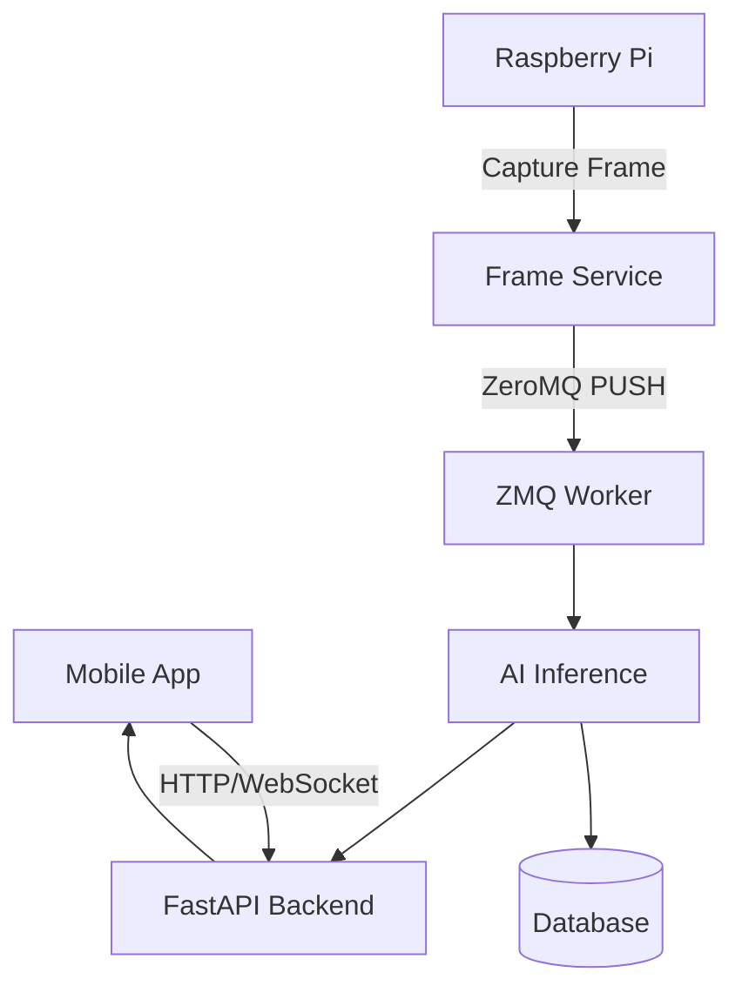
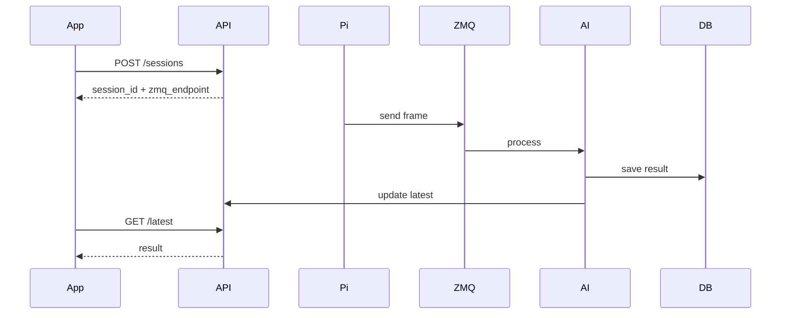
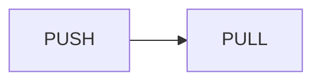
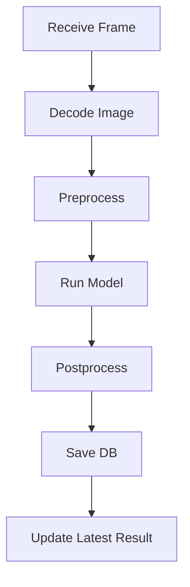
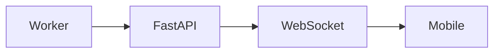

# 🚀 PBL5 - Backend + ZeroMQ Architecture & Implementation Guide

---

# 🎯 0. Mục tiêu hệ thống

Xây dựng hệ thống:

* 📱 Mobile App → điều khiển + hiển thị kết quả
* 🖥 Backend (FastAPI) → quản lý session + trả dữ liệu
* 🍓 Raspberry Pi → chụp ảnh + gửi frame
* 🧠 AI Worker → xử lý pose estimation
* ⚡ ZeroMQ → truyền frame realtime

---

# 🧠 1. Tổng quan kiến trúc



---

# 🔥 2. Tư duy kiến trúc (CỰC QUAN TRỌNG)

## ❌ Sai lầm

* Pi gọi API `/predict`
* Backend xử lý trực tiếp
* trả kết quả

👉 KHÔNG scalable, dễ lag

---

## ✅ Đúng cách

Tách 2 luồng:

### 🔹 Control Plane (HTTP)

* Mobile ↔ FastAPI
* tạo session
* xem kết quả

### 🔹 Data Plane (ZeroMQ)

* Pi → Worker
* gửi frame liên tục

---

# ⚙️ 3. Luồng hoạt động chuẩn



---

# 📁 4. Cấu trúc project

```bash
backend/
├── app/
│   ├── main.py
│   ├── api/
│   │   ├── sessions.py
│   │   ├── results.py
│   │   └── websocket.py
│   ├── core/
│   │   ├── config.py
│   │   └── zmq_manager.py
│   ├── db/
│   │   └── database.py
│   ├── models/
│   │   ├── session.py
│   │   └── result.py
│   ├── schemas/
│   │   ├── session.py
│   │   └── result.py
│   ├── services/
│   │   ├── session_service.py
│   │   ├── result_service.py
│   │   └── inference.py
│
├── workers/
│   └── zmq_worker.py
│
├── requirements.txt
└── run.py
```

---

# 🧩 5. Thành phần hệ thống

---

## 📱 Mobile App

Nhiệm vụ:

* start session
* stop session
* xem kết quả
* realtime UI

---

## 🖥 FastAPI Backend

Nhiệm vụ:

* quản lý session
* lưu DB
* trả dữ liệu cho app
* WebSocket realtime

---

## 🍓 Raspberry Pi

Nhiệm vụ:

* mở camera
* lấy frame
* resize + compress
* gửi ZeroMQ

---

## ⚡ ZMQ Worker

Nhiệm vụ:

* nhận frame từ Pi
* decode ảnh
* gọi AI
* lưu DB

---

## 🧠 AI Service

Nhiệm vụ:

* load model `.pth`
* predict keypoints
* trả kết quả

---

# 🔌 6. ZeroMQ Design

---

## 🎯 Pattern dùng: PUSH / PULL



---

## 🧠 Ý nghĩa

* Pi = producer
* Worker = consumer
* không cần request/response

---

# 📦 7. Format message

## Multipart message

```text
[metadata_json, image_bytes]
```

---

## Metadata mẫu

```json
{
  "session_id": "sess_001",
  "frame_id": 12,
  "timestamp": 1710000000,
  "width": 640,
  "height": 480
}
```

---

## Image

* JPEG bytes
* KHÔNG base64

---

# 🧪 8. Flow xử lý frame



---

# 🗄 9. Database Design

---

## Table: sessions

| field      | type     |
| ---------- | -------- |
| id         | string   |
| device_id  | string   |
| status     | string   |
| created_at | datetime |

---

## Table: results

| field      | type     |
| ---------- | -------- |
| id         | int      |
| session_id | string   |
| frame_id   | int      |
| keypoints  | json     |
| confidence | float    |
| created_at | datetime |

---

# 🌐 10. API Design

---

## POST /sessions

Tạo session

```json
Request:
{
  "device_id": "raspi_01"
}
```

```json
Response:
{
  "session_id": "abc123",
  "zmq_endpoint": "tcp://192.168.1.10:5555"
}
```

---

## GET /sessions/{id}

Lấy info session

---

## GET /sessions/{id}/latest

Lấy kết quả mới nhất

---

## POST /sessions/{id}/start

Bắt đầu session

---

## POST /sessions/{id}/stop

Dừng session

---

# ⚡ 11. WebSocket (Realtime)



---

# 🧠 12. Logic quan trọng

---

## 🔥 Frame sampling

KHÔNG gửi full 30fps

👉 chỉ gửi:

* 2–5 fps

---

## 🔥 Drop frame cũ

Nếu backlog:

```text
chỉ giữ frame mới nhất
```

---

## 🔥 Session state

```text
created → running → stopped
```

---

# 🧱 13. Worker design

---

## ZMQ Worker loop

```text
while True:
    receive frame
    decode
    run inference
    save result
```

---

## Không được:

* block quá lâu
* crash toàn hệ thống

---

# 🚀 14. Deployment đơn giản

---

## Chạy backend

```bash
uvicorn app.main:app --reload
```

---

## Chạy worker

```bash
python workers/zmq_worker.py
```

---

## Pi chạy sender

```bash
python sender.py
```

---

# 📊 15. Phase triển khai

---

## Phase 1

* dựng FastAPI
* tạo session API

---

## Phase 2

* ZMQ send/receive test

---

## Phase 3

* gửi image thật

---

## Phase 4

* gắn model AI

---

## Phase 5

* realtime WebSocket

---

# 🎯 16. MVP cần đạt

* tạo session từ app
* Pi gửi frame
* backend nhận được
* lưu DB
* app xem được kết quả

---

# 💡 17. Checklist

* [ ] FastAPI chạy được
* [ ] tạo session OK
* [ ] Pi gửi message OK
* [ ] backend nhận OK
* [ ] decode ảnh OK
* [ ] lưu DB OK
* [ ] app gọi API OK

---

# 🔥 18. Tóm tắt 1 dòng

```text
Pi gửi frame bằng ZeroMQ → Worker xử lý → FastAPI trả kết quả → Mobile hiển thị
```

---

# 🚀 19. Bước tiếp theo

👉 Bắt đầu Phase 1:

* tạo FastAPI project
* tạo `/sessions`
* test bằng Postman

👉 Sau đó qua Phase 2:

* dựng ZMQ worker
* test Pi gửi message

---
