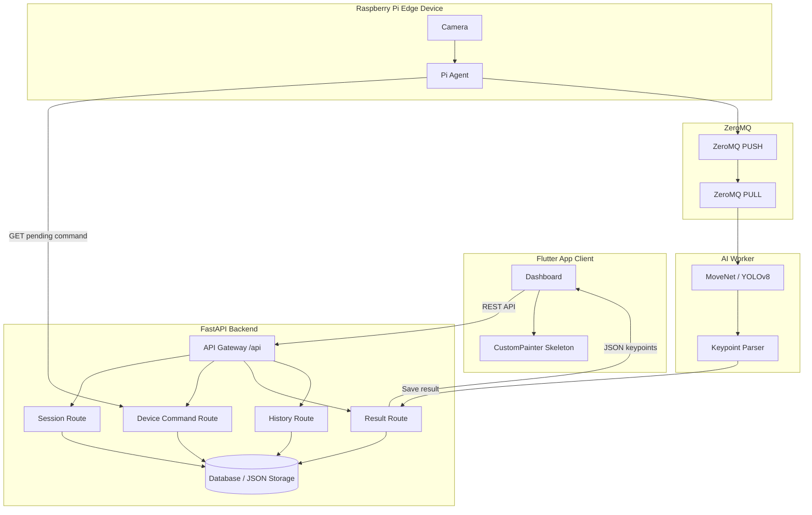
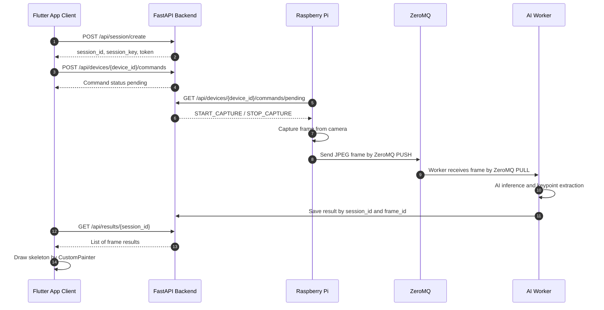
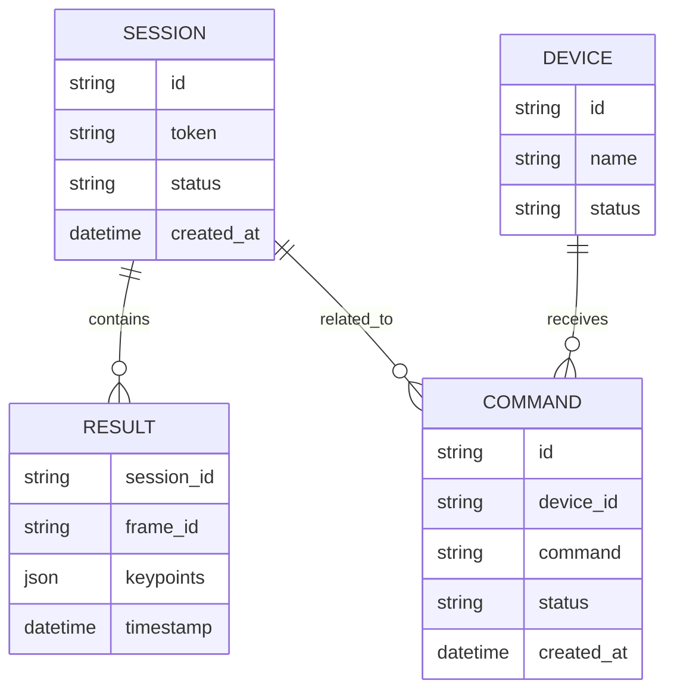

# BÁO CÁO HỌC PHẦN PBL5: DỰ ÁN KỸ THUẬT MÁY TÍNH

**Trường:** Đại học Đà Nẵng - Trường Đại học Bách Khoa  
**Khoa:** Công nghệ Thông tin  
**Tên đề tài:** Hệ thống nhận diện, phân tích và đánh giá tư thế người theo thời gian thực kết hợp kiến trúc IoT Edge - Cloud  
**Sinh viên thực hiện:** Nguyễn Hà - Lớp: 23T_DT3 - Nhóm: 23.12  
**Công nghệ sử dụng:** MoveNet, YOLOv8, FastAPI, ZeroMQ, Python, Raspberry Pi, Flutter App

---

# PHẦN MỞ ĐẦU

## 1. Bối cảnh chọn đề tài

Trong thời đại công nghệ số, trí tuệ nhân tạo, thị giác máy tính và Internet vạn vật đang được ứng dụng ngày càng rộng rãi trong các lĩnh vực như chăm sóc sức khỏe, thể thao, giám sát an toàn và tương tác người - máy. Trong đó, bài toán ước lượng tư thế người là một hướng nghiên cứu có giá trị thực tiễn cao vì cho phép máy tính nhận biết vị trí các khớp chính trên cơ thể người từ hình ảnh hoặc video.

Việc phân tích tư thế người có thể được ứng dụng trong nhiều bài toán như theo dõi luyện tập thể thao, hỗ trợ phục hồi chức năng, đánh giá động tác, cảnh báo tư thế sai và giám sát hành vi. Tuy nhiên, để xây dựng một hệ thống có khả năng hoạt động gần thời gian thực, hệ thống cần giải quyết đồng thời nhiều vấn đề về xử lý ảnh, truyền dữ liệu, độ trễ, khả năng mở rộng và hiển thị kết quả trực quan cho người dùng.

Từ nhu cầu đó, nhóm thực hiện đề tài **“Hệ thống nhận diện, phân tích và đánh giá tư thế người theo thời gian thực kết hợp kiến trúc IoT Edge - Cloud”**. Hệ thống sử dụng Raspberry Pi làm thiết bị Edge để thu thập dữ liệu hình ảnh, sử dụng ZeroMQ để truyền frame ảnh đến AI Worker, sử dụng FastAPI làm Backend quản lý phiên và điều phối lệnh, đồng thời sử dụng Flutter App làm giao diện hiển thị kết quả cho người dùng.

## 2. Mục tiêu đề tài

Đề tài hướng đến việc xây dựng một hệ thống phần mềm có khả năng nhận diện và hiển thị tư thế người theo thời gian thực. Các mục tiêu chính bao gồm:

1. Xây dựng thiết bị Edge sử dụng Raspberry Pi để thu thập hình ảnh từ camera.
2. Truyền frame ảnh từ Raspberry Pi đến AI Worker bằng ZeroMQ nhằm giảm độ trễ truyền dữ liệu.
3. Xây dựng Backend bằng FastAPI để quản lý session, command, result và history.
4. Sử dụng mô hình AI như MoveNet hoặc YOLOv8 để nhận diện keypoints của cơ thể người.
5. Xây dựng ứng dụng Flutter App để điều khiển thiết bị và trực quan hóa skeleton.
6. Thiết kế hệ thống theo hướng mở rộng, dễ bảo trì và có thể phát triển thêm các chức năng đánh giá động tác.

## 3. Phạm vi thực hiện

Trong phạm vi hiện tại, hệ thống tập trung vào các chức năng chính sau:

- Tạo phiên làm việc mới.
- Gửi lệnh điều khiển đến Raspberry Pi.
- Raspberry Pi lấy lệnh pending từ Backend.
- Raspberry Pi truyền ảnh đến AI Worker thông qua ZeroMQ.
- AI Worker xử lý ảnh và sinh dữ liệu keypoints.
- Backend lưu trữ và cung cấp kết quả phân tích theo session và frame.
- Ứng dụng Flutter App lấy kết quả và vẽ skeleton lên giao diện.
- Xem lịch sử toàn hệ thống.

Một số chức năng như đánh giá tư thế bằng API riêng, lấy kết quả mới nhất bằng endpoint `/latest`, hoặc quản lý người dùng theo `user_id` chưa được triển khai trong Backend hiện tại và được đưa vào hướng phát triển.

---

# CHƯƠNG 1. CƠ SỞ LÝ THUYẾT

## 1.1. Human Pose Estimation

Human Pose Estimation là bài toán xác định vị trí các điểm khớp chính của cơ thể người từ ảnh hoặc video. Các điểm khớp thường bao gồm mũi, mắt, vai, khuỷu tay, cổ tay, hông, đầu gối và mắt cá chân. Kết quả đầu ra của mô hình thường là danh sách các keypoints, trong đó mỗi keypoint có tọa độ và điểm tin cậy.

Trong hệ thống này, dữ liệu keypoints được sử dụng để vẽ skeleton người dùng trên giao diện. Ở các phiên bản phát triển tiếp theo, dữ liệu này có thể được dùng để tính góc khớp, đếm số lần tập và đánh giá mức độ chính xác của động tác.

## 1.2. MoveNet và YOLOv8

MoveNet là mô hình ước lượng tư thế người được thiết kế để đạt tốc độ xử lý nhanh, phù hợp với các ứng dụng thời gian thực. Mô hình có thể phát hiện các điểm khớp chính của cơ thể và trả về tọa độ tương ứng trong ảnh.

YOLOv8 là mô hình thuộc nhóm one-stage detection, thường được sử dụng để phát hiện đối tượng trong ảnh. Trong hệ thống phân tích tư thế, YOLOv8 có thể được dùng để phát hiện người trước khi thực hiện bước trích xuất keypoints hoặc hỗ trợ trong các bài toán nhận diện đối tượng liên quan.

## 1.3. FastAPI

FastAPI là framework Python dùng để xây dựng Web API. Framework này hỗ trợ xử lý bất đồng bộ, khai báo dữ liệu bằng Pydantic và dễ dàng xây dựng RESTful API. Trong đồ án, FastAPI được sử dụng làm Backend chính để quản lý phiên làm việc, điều phối command cho Raspberry Pi và cung cấp dữ liệu kết quả cho ứng dụng Client.

## 1.4. ZeroMQ

ZeroMQ là thư viện truyền thông hiệu năng cao dựa trên socket. Trong hệ thống, ZeroMQ được sử dụng để truyền ảnh từ Raspberry Pi đến AI Worker. Cơ chế PUSH/PULL giúp thiết bị Edge có thể đẩy frame ảnh vào hàng đợi, trong khi AI Worker lấy frame ra để xử lý.

Việc tách luồng ảnh khỏi REST API giúp hệ thống giảm tải cho Backend và phù hợp hơn với bài toán truyền dữ liệu liên tục.

## 1.5. Flutter App

Flutter là framework phát triển ứng dụng đa nền tảng. Trong hệ thống, Flutter App được sử dụng để xây dựng giao diện điều khiển và hiển thị kết quả. Ứng dụng có nhiệm vụ gửi lệnh điều khiển, tạo session, truy xuất kết quả từ Backend và vẽ skeleton bằng dữ liệu keypoints.

---

# CHƯƠNG 2. PHÂN TÍCH VÀ THIẾT KẾ HỆ THỐNG

## 2.1. Yêu cầu chức năng

### FR1. Quản lý phiên làm việc

Hệ thống cho phép tạo session mới thông qua API. Mỗi session được định danh bằng `session_id`, `session_key` và `token`. Session là cơ sở để lưu trữ và truy xuất kết quả phân tích tư thế.

### FR2. Điều khiển thiết bị Raspberry Pi

Client có thể gửi lệnh điều khiển đến Raspberry Pi thông qua Backend. Các lệnh được lưu ở trạng thái pending để Raspberry Pi định kỳ lấy về và thực thi.

### FR3. Thu thập và truyền ảnh

Raspberry Pi thu thập ảnh từ camera, nén frame ảnh và gửi đến AI Worker qua ZeroMQ. Luồng ảnh không đi qua REST API nhằm giảm độ trễ và tránh nghẽn Backend.

### FR4. Nhận diện tư thế người

AI Worker nhận frame ảnh từ ZeroMQ, xử lý bằng mô hình AI và sinh kết quả keypoints. Kết quả được lưu theo `session_id` và `frame_id`.

### FR5. Trực quan hóa kết quả

Ứng dụng Flutter App lấy kết quả phân tích từ Backend và vẽ skeleton lên giao diện bằng các tọa độ keypoints.

### FR6. Xem lịch sử hệ thống

Backend cung cấp API xem lịch sử toàn hệ thống, bao gồm session, task và command.

## 2.2. Yêu cầu phi chức năng

- **Hiệu năng:** Luồng truyền ảnh và xử lý AI cần có độ trễ thấp để đáp ứng yêu cầu gần thời gian thực.
- **Khả năng mở rộng:** Hệ thống có thể mở rộng bằng cách tăng số lượng AI Worker nhận dữ liệu từ ZeroMQ.
- **Dễ bảo trì:** Backend được chia thành các route riêng như session, devices, results và history.
- **Tính tương thích:** Flutter App có thể chạy trên trình duyệt, đồng thời có thể mở rộng sang các nền tảng native.
- **Tính riêng tư:** Dữ liệu ảnh chỉ phục vụ quá trình phân tích, kết quả lưu trữ chủ yếu là dữ liệu keypoints và thông tin phiên.

## 2.3. Kiến trúc tổng quan



## 2.4. Luồng xử lý chính



## 2.5. Thiết kế dữ liệu mức khái niệm



Lưu ý: mô hình trên mô tả ở mức khái niệm. Trong Backend hiện tại, `SessionModel` gồm các trường chính `id`, `token`, `status`, `created_at`; hệ thống chưa có `user_id` và `exercise_type`.

---

# CHƯƠNG 3. TRIỂN KHAI HỆ THỐNG

## 3.1. Môi trường và công nghệ sử dụng

| Thành phần | Công nghệ |
|---|---|
| Thiết bị Edge | Raspberry Pi |
| Camera | Camera module hoặc webcam |
| Backend | FastAPI, Python |
| Truyền ảnh | ZeroMQ PUSH/PULL |
| AI Worker | Python, MoveNet/YOLOv8 |
| Frontend | Flutter App |
| Dữ liệu trả về | JSON keypoints |
| Triển khai cloud | Railway hoặc môi trường server tương đương |

## 3.2. Truyền thông

### 3.2.1. RESTful API

RESTful API là phương thức giao tiếp giữa ứng dụng Client và Backend thông qua giao thức HTTP. Trong hệ thống này, RESTful API được sử dụng cho các chức năng quản lý như tạo phiên làm việc, gửi lệnh điều khiển, lấy kết quả phân tích và xem lịch sử.

Các phương thức HTTP được sử dụng gồm:

- **GET:** Lấy tài nguyên hoặc danh sách tài nguyên.
- **POST:** Tạo mới tài nguyên hoặc gửi lệnh mới.
- **PATCH:** Cập nhật một phần tài nguyên, ví dụ cập nhật trạng thái command.
- **DELETE:** Có thể dùng cho chức năng xóa tài nguyên trong các phiên bản phát triển sau.

Trong mã nguồn Backend hiện tại, tất cả endpoint đều có tiền tố `/api`. Vì vậy, các đường dẫn API chính thức của hệ thống đều bắt đầu bằng `/api`.

### 3.2.2. ZeroMQ

ZeroMQ được sử dụng cho luồng truyền frame ảnh từ Raspberry Pi đến AI Worker. Raspberry Pi sau khi capture ảnh từ camera sẽ nén frame thành định dạng ảnh và gửi qua ZeroMQ PUSH Socket. AI Worker sử dụng ZeroMQ PULL Socket để nhận frame và xử lý.

Luồng truyền ảnh:

```text
Camera → Raspberry Pi Agent → ZeroMQ PUSH → ZeroMQ PULL → AI Worker
```

Ưu điểm của ZeroMQ trong hệ thống:

- Phù hợp với dữ liệu nhị phân như ảnh.
- Có độ trễ thấp hơn so với việc gửi frame liên tục bằng HTTP POST.
- Hỗ trợ mở rộng nhiều AI Worker.
- Tách luồng dữ liệu ảnh khỏi Backend API.

### 3.2.3. HTTP Polling

Ứng dụng Flutter App sử dụng HTTP Polling để lấy kết quả phân tích từ Backend. Client có thể gọi API lấy toàn bộ kết quả của một session hoặc lấy kết quả của một frame cụ thể.

Backend hiện tại chưa có endpoint `/latest`, do đó Client có thể lấy danh sách frame qua `/api/results/{session_id}` rồi chọn frame mới nhất ở phía ứng dụng.

---

## 3.3. Phần mềm

## 3.3.1. Server

Server Backend được xây dựng bằng FastAPI. Trong file `main.py`, các router được include với prefix `/api`, vì vậy toàn bộ endpoint của hệ thống đều bắt đầu bằng `/api`.

Backend có nhiệm vụ:

- Tạo và quản lý session.
- Nhận lệnh điều khiển từ Client.
- Cung cấp lệnh pending cho Raspberry Pi.
- Cập nhật trạng thái lệnh sau khi thiết bị xử lý.
- Lưu và cung cấp kết quả phân tích tư thế.
- Cung cấp lịch sử toàn hệ thống.

### 3.3.1.1. Chức năng tạo phiên làm việc

Client tạo phiên làm việc mới thông qua endpoint:

```http
POST /api/session/create
```

Ở phiên bản Backend hiện tại, session không có các trường `user_id`, `device_id` hoặc `exercise_type`. Model session gồm các trường chính:

```text
id
token
status
created_at
```

Response trả về gồm:

```json
{
  "session_id": "session_001",
  "session_key": "sample_session_key",
  "token": "sample_token"
}
```

Chức năng này giúp hệ thống tạo ra một phiên làm việc riêng để lưu và truy xuất kết quả phân tích tư thế.

### 3.3.1.2. Chức năng gửi lệnh điều khiển đến Raspberry Pi

Client gửi lệnh điều khiển thiết bị thông qua endpoint:

```http
POST /api/devices/{device_id}/commands
```

Ví dụ dữ liệu gửi lên:

```json
{
  "command": "START_CAPTURE"
}
```

Response ví dụ:

```json
{
  "message": "Command created successfully",
  "device_id": "pi_001",
  "command": "START_CAPTURE",
  "status": "pending"
}
```

Lệnh sau khi được tạo sẽ ở trạng thái `pending` để Raspberry Pi lấy về và thực hiện.

### 3.3.1.3. Chức năng Raspberry Pi lấy lệnh pending

Raspberry Pi định kỳ gọi API để lấy lệnh đang chờ xử lý:

```http
GET /api/devices/{device_id}/commands/pending
```

Response ví dụ:

```json
{
  "command_id": "cmd_001",
  "device_id": "pi_001",
  "command": "START_CAPTURE",
  "status": "pending",
  "created_at": "2026-06-06T09:30:00"
}
```

Khi nhận được lệnh `START_CAPTURE`, Raspberry Pi bật camera và bắt đầu truyền frame qua ZeroMQ. Khi nhận được lệnh `STOP_CAPTURE`, Raspberry Pi dừng quá trình capture.

### 3.3.1.4. Chức năng cập nhật trạng thái lệnh

Sau khi Raspberry Pi nhận hoặc xử lý xong lệnh, thiết bị cập nhật trạng thái command thông qua endpoint:

```http
PATCH /api/devices/{device_id}/commands/{command_id}/status
```

Ví dụ request:

```json
{
  "status": "completed"
}
```

Response ví dụ:

```json
{
  "message": "Command status updated successfully",
  "command_id": "cmd_001",
  "status": "completed"
}
```

Chức năng này giúp Backend biết lệnh đã được thiết bị tiếp nhận hoặc xử lý, tránh việc xử lý lặp lại command cũ.

### 3.3.1.5. Chức năng truyền ảnh từ Raspberry Pi đến AI Worker

Luồng ảnh không truyền qua REST API mà được truyền trực tiếp bằng ZeroMQ. Raspberry Pi lấy ảnh từ camera, mã hóa/nén frame, sau đó gửi đến AI Worker thông qua ZeroMQ PUSH Socket.

```text
Raspberry Pi Camera
        ↓
Capture frame
        ↓
Encode / Compress image
        ↓
ZeroMQ PUSH
        ↓
ZeroMQ PULL
        ↓
AI Worker
```

Thiết kế này giúp hệ thống giảm độ trễ và tránh việc Backend phải xử lý luồng ảnh liên tục.

### 3.3.1.6. Chức năng phân tích tư thế người

AI Worker nhận frame từ ZeroMQ và chạy mô hình AI để trích xuất keypoints. Kết quả phân tích được lưu theo `session_id` và `frame_id`.

Ví dụ dữ liệu keypoints:

```json
{
  "session_id": "session_001",
  "frame_id": "frame_001",
  "keypoints": [
    {
      "name": "nose",
      "x": 0.51,
      "y": 0.18,
      "score": 0.95
    },
    {
      "name": "left_shoulder",
      "x": 0.43,
      "y": 0.36,
      "score": 0.90
    },
    {
      "name": "right_shoulder",
      "x": 0.60,
      "y": 0.36,
      "score": 0.92
    }
  ]
}
```

### 3.3.1.7. Chức năng lấy toàn bộ kết quả của một session

Client lấy toàn bộ kết quả phân tích của một phiên thông qua endpoint:

```http
GET /api/results/{session_id}
```

Response ví dụ:

```json
{
  "session_id": "session_001",
  "results": [
    {
      "frame_id": "frame_001",
      "timestamp": "2026-06-06T09:00:01",
      "keypoints": []
    },
    {
      "frame_id": "frame_002",
      "timestamp": "2026-06-06T09:00:02",
      "keypoints": []
    }
  ]
}
```

### 3.3.1.8. Chức năng lấy kết quả của một frame cụ thể

Client có thể lấy dữ liệu keypoints của một frame cụ thể thông qua endpoint:

```http
GET /api/results/{session_id}/{frame_id}
```

Response ví dụ:

```json
{
  "session_id": "session_001",
  "frame_id": "frame_102",
  "timestamp": "2026-06-06T09:05:20",
  "keypoints": [
    {
      "name": "left_shoulder",
      "x": 0.42,
      "y": 0.35,
      "score": 0.91
    },
    {
      "name": "left_elbow",
      "x": 0.47,
      "y": 0.52,
      "score": 0.88
    }
  ]
}
```

Dữ liệu này được Flutter App sử dụng để vẽ skeleton của người dùng lên giao diện.

### 3.3.1.9. Chức năng xem lịch sử toàn hệ thống

Backend cung cấp endpoint xem lịch sử toàn hệ thống:

```http
GET /api/history
```

Response ví dụ:

```json
{
  "history": [
    {
      "session_id": "session_001",
      "status": "active",
      "created_at": "2026-06-06T09:00:00",
      "commands": [
        {
          "command_id": "cmd_001",
          "command": "START_CAPTURE",
          "status": "done"
        }
      ]
    }
  ]
}
```

Ở phiên bản hiện tại, hệ thống chưa có khái niệm `user_id`, do đó không sử dụng API dạng `/users/{user_id}/sessions`.

## 3.3.2. Bảng tổng hợp API

| STT | Chức năng | Method | Endpoint | Mô tả |
|---|---|---|---|---|
| 1 | Tạo phiên tập | POST | `/api/session/create` | Tạo session mới, trả về token và key |
| 2 | Đăng ký thiết bị | POST | `/api/devices/register` | Đăng ký Raspberry Pi, nhận auth_token |
| 3 | Lấy danh sách thiết bị | GET | `/api/devices` | Trả về danh sách các thiết bị |
| 4 | Gửi heartbeat | POST | `/api/devices/{device_id}/heartbeat` | Thiết bị báo cáo trạng thái đang hoạt động |
| 5 | Gửi lệnh đến thiết bị | POST | `/api/devices/{device_id}/commands` | Client gửi lệnh điều khiển Start/Stop |
| 6 | Raspberry Pi lấy lệnh pending | GET | `/api/devices/{device_id}/commands/pending` | Thiết bị Pi lấy lệnh chờ xử lý cũ nhất |
| 7 | Cập nhật trạng thái lệnh | PATCH | `/api/devices/{device_id}/commands/{command_id}/status` | Cập nhật trạng thái sau khi Pi nhận hoặc xử lý lệnh |
| 8 | Lấy kết quả của một session | GET | `/api/results/{session_id}` | Xem toàn bộ kết quả của một phiên |
| 9 | Lấy kết quả frame cụ thể | GET | `/api/results/{session_id}/{frame_id}` | Client lấy dữ liệu keypoints của một frame cụ thể |
| 10 | Xem lịch sử toàn hệ thống | GET | `/api/history` | Xem lịch sử các session, task và command |

## 3.3.3. Các API chưa triển khai trong phiên bản hiện tại

Một số endpoint không có trong Backend hiện tại nên không được xem là chức năng chính thức của hệ thống:

| Chức năng | Endpoint giả định | Trạng thái |
|---|---|---|
| Kết thúc session bằng API riêng | `PATCH /sessions/{session_id}/stop` | Chưa triển khai |
| Lấy kết quả mới nhất | `GET /sessions/{session_id}/results/latest` | Chưa triển khai |
| Lịch sử theo user | `GET /users/{user_id}/sessions` | Chưa triển khai do chưa có `user_id` |
| Đánh giá tư thế bằng API riêng | `POST /sessions/{session_id}/evaluate` | Chưa triển khai |

Trong phiên bản hiện tại, việc dừng thu hình được xử lý thông qua command gửi đến Raspberry Pi. Việc lấy frame mới nhất có thể được xử lý ở phía Client bằng cách gọi `/api/results/{session_id}` và chọn frame cuối cùng.

---

# CHƯƠNG 4. GIAO DIỆN VÀ KẾT QUẢ THỰC NGHIỆM

## 4.1. Giao diện ứng dụng

Ứng dụng Flutter App đóng vai trò là dashboard điều khiển và hiển thị kết quả phân tích tư thế. Các thành phần chính của giao diện gồm:

- Khu vực hiển thị camera hoặc preview.
- Nút tạo phiên làm việc.
- Nút gửi lệnh bắt đầu hoặc dừng capture.
- Khu vực hiển thị skeleton dựa trên dữ liệu keypoints.
- Khu vực xem lịch sử hoặc kết quả của session.

## 4.2. Luồng hiển thị skeleton

Sau khi AI Worker xử lý frame và lưu kết quả, Client gọi API lấy kết quả theo session hoặc frame cụ thể. Dữ liệu keypoints được đưa vào lớp vẽ của Flutter để hiển thị các điểm khớp và đường nối giữa các khớp.

```text
GET /api/results/{session_id}
        ↓
Parse JSON keypoints
        ↓
Scale tọa độ theo kích thước màn hình
        ↓
CustomPainter vẽ joints và bones
```

## 4.3. Kịch bản kiểm thử

| STT | Kịch bản | Mục tiêu | Kết quả mong đợi |
|---|---|---|---|
| 1 | Tạo session mới | Kiểm tra API session | Trả về `session_id`, `session_key`, `token` |
| 2 | Gửi command Start | Kiểm tra command route | Command được tạo với trạng thái `pending` |
| 3 | Pi lấy command pending | Kiểm tra polling từ thiết bị | Pi nhận được command cũ nhất |
| 4 | Cập nhật trạng thái command | Kiểm tra cập nhật trạng thái | Command chuyển sang trạng thái mới |
| 5 | Truyền frame qua ZeroMQ | Kiểm tra luồng ảnh | AI Worker nhận được frame |
| 6 | Lấy kết quả session | Kiểm tra result route | Trả về danh sách frame result |
| 7 | Lấy kết quả frame cụ thể | Kiểm tra chi tiết frame | Trả về keypoints của frame |
| 8 | Xem history | Kiểm tra history route | Trả về lịch sử session/task/command |

## 4.4. Đánh giá hệ thống

Hệ thống đã xây dựng được kiến trúc phân tách rõ ràng giữa Client, Backend, Edge Device và AI Worker. REST API đảm nhiệm các chức năng quản lý và truy xuất dữ liệu, trong khi ZeroMQ đảm nhiệm luồng truyền frame ảnh có tần suất cao.

Ưu điểm của hệ thống:

- Kiến trúc rõ ràng, dễ mở rộng.
- API đã bám sát các chức năng chính của Backend.
- Luồng ảnh được tách khỏi REST API, phù hợp với bài toán thời gian thực.
- Dữ liệu kết quả được tổ chức theo session và frame.
- Flutter App có thể hiển thị skeleton dựa trên JSON keypoints.

Hạn chế hiện tại:

- Chưa có API kết thúc session riêng.
- Chưa có API lấy kết quả mới nhất `/latest`.
- Chưa có quản lý người dùng bằng `user_id`.
- Chưa có API đánh giá tư thế riêng.
- Chưa có bảng benchmark chi tiết về FPS, latency, CPU và RAM.

---

# CHƯƠNG 5. KẾT LUẬN VÀ HƯỚNG PHÁT TRIỂN

## 5.1. Kết luận

Đề tài đã xây dựng được một hệ thống nhận diện và phân tích tư thế người theo mô hình IoT Edge - Cloud. Raspberry Pi đóng vai trò thiết bị thu thập ảnh tại biên, ZeroMQ đảm nhiệm truyền frame ảnh đến AI Worker, FastAPI Backend quản lý session, command, result và history, còn Flutter App đảm nhiệm giao diện điều khiển và trực quan hóa skeleton.

Hệ thống thể hiện được cách kết hợp giữa phần cứng Edge, truyền thông mạng, Backend API và AI trong một bài toán kỹ thuật máy tính thực tế. Việc sử dụng ZeroMQ cho luồng ảnh và REST API cho luồng điều khiển giúp hệ thống có kiến trúc hợp lý, dễ mở rộng và phù hợp với bài toán gần thời gian thực.

## 5.2. Hạn chế

Mặc dù hệ thống đã hoàn thành các chức năng chính, vẫn còn một số hạn chế:

- Chưa có chức năng quản lý người dùng hoàn chỉnh.
- Chưa có endpoint riêng để dừng session.
- Chưa có endpoint `/latest` để lấy frame mới nhất nhanh hơn.
- Việc đánh giá tư thế mới dừng ở mức định hướng, chưa có API riêng.
- Chưa có báo cáo đo hiệu năng chi tiết trên nhiều cấu hình phần cứng khác nhau.

## 5.3. Hướng phát triển

Trong tương lai, hệ thống có thể được phát triển thêm theo các hướng sau:

1. **Bổ sung API kết thúc session:** Xây dựng endpoint riêng để cập nhật trạng thái session khi người dùng kết thúc phiên tập.
2. **Bổ sung API latest result:** Xây dựng endpoint `/api/results/{session_id}/latest` để Client lấy frame mới nhất thuận tiện hơn.
3. **Bổ sung đánh giá tư thế:** Tính góc giữa các khớp để đánh giá bài tập như squat, push-up hoặc plank.
4. **Quản lý người dùng:** Bổ sung user model, authentication và lịch sử theo từng người dùng.
5. **Tối ưu AI Worker:** Tối ưu mô hình, lượng tử hóa model hoặc triển khai inference trực tiếp trên thiết bị Edge.
6. **Ứng dụng WebRTC:** Sử dụng WebRTC để hiển thị live preview mượt hơn trên trình duyệt.
7. **Container hóa hệ thống:** Đóng gói Backend, Worker và các service liên quan bằng Docker để dễ triển khai.

---

# TÀI LIỆU THAM KHẢO

[1] Tài liệu FastAPI.  
[2] Tài liệu ZeroMQ.  
[3] Tài liệu Flutter.  
[4] Tài liệu MoveNet.  
[5] Tài liệu YOLOv8.  
[6] Mã nguồn Backend của hệ thống trong thư mục `backend/app/api/routes`.

---

# PHỤ LỤC

## A. Danh sách endpoint chính thức

```text
POST  /api/session/create
POST  /api/devices/{device_id}/commands
GET   /api/devices/{device_id}/commands/pending
PATCH /api/devices/{device_id}/commands/{command_id}/status
GET   /api/results/{session_id}
GET   /api/results/{session_id}/{frame_id}
GET   /api/history
```

## B. Ghi chú đồng bộ với mã nguồn

Báo cáo đã được chỉnh sửa để không dùng các endpoint chưa có trong Backend hiện tại như `/sessions`, `/users/{user_id}/sessions`, `/results/latest` hoặc `/evaluate`. Các chức năng chưa triển khai được chuyển sang mục hạn chế và hướng phát triển.

**----- HẾT BÁO CÁO -----**
