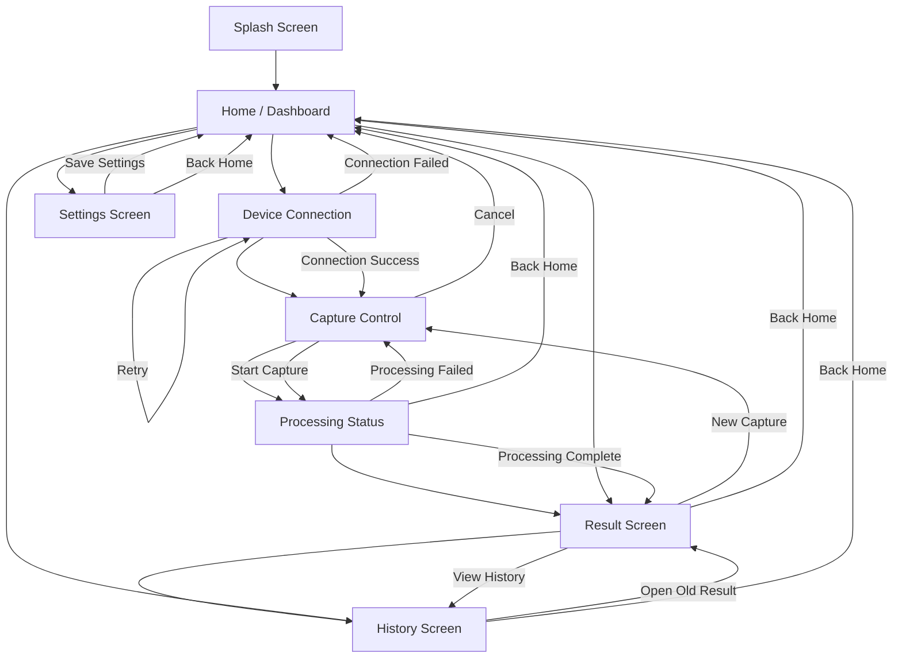

```mermaid
flowchart TD
    A["Splash Screen"] --> B["Home / Dashboard"]
    B --> C["Device Connection"]
    C --> D["Capture Control"]
    D --> E["Processing Status"]
    E --> F["Result Screen"]
    F --> G["History Screen"]

    B --> H["Settings Screen"]
    B --> F
    B --> G

    C -->|"Connection Success"| D
    C -->|"Connection Failed"| B
    C -->|"Retry"| C

    D -->|"Start Capture"| E
    D -->|"Cancel"| B

    E -->|"Processing Complete"| F
    E -->|"Processing Failed"| D
    E -->|"Back Home"| B

    F -->|"View History"| G
    F -->|"New Capture"| D
    F -->|"Back Home"| B

    G -->|"Open Old Result"| F
    G -->|"Back Home"| B

    H -->|"Save Settings"| B
    H -->|"Back Home"| B
```
