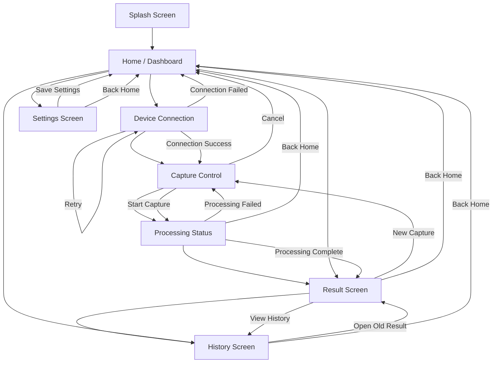

# 🔄 PoseTrack Mobile App - Navigation Flow
*Tài liệu mô tả luồng điều hướng và sơ đồ hoạt động của ứng dụng PoseTrack*

---

## 1. Flow điều hướng chính của app

Flow chính (Luồng lý tưởng nhất) nên đi theo trình tự đơn giản sau:

> **Splash** → **Home** → **Connect** → **Capture** → **Processing** → **Result** → **History**

Dưới đây là sơ đồ Mermaid trực quan tổng quát tất cả các nhánh trong ứng dụng:



Đây là flow rất hợp lý vì nó đi đúng hành vi người dùng ngoài đời thực:
1. Mở app
2. Kiểm tra kết nối
3. Bắt đầu ghi hình
4. Chờ xử lý
5. Xem kết quả
6. Xem lại lịch sử

---

## 2. Flow chi tiết hơn theo điều hướng thật

### 🛣️ Luồng chính
**Splash** ➔ **Home** ➔ **Device Connection** ➔ **Capture Control** ➔ **Processing Status** ➔ **Result** ➔ **History**

### 🔀 Các nhánh phụ

**Từ trang Home:**
Người dùng có thể đi tới:
- `Home` ➔ `Device Connection`
- `Home` ➔ `Capture Control`
- `Home` ➔ `Result`
- `Home` ➔ `History`
- `Home` ➔ `Settings`

> 💡 **Mẹo Demo:** Để logic nhất, trong lúc demo nên dẫn dắt ban giám khảo đi theo con đường: `Home` ➔ `Device Connection` ➔ `Capture Control`.

**Từ trang Device Connection:**
- ✅ **Kết nối thành công:** `Device Connection` ➔ `Capture Control`
- ❌ **Kết nối thất bại:** `Device Connection` ➔ `Home`
- 🔄 **Thử lại:** `Device Connection` ➔ `Reconnect` ➔ `Device Connection`

**Từ trang Capture Control:**
Sau khi người dùng bấm quay/chụp:
- ✅ **Thành công:** `Capture Control` ➔ `Processing Status`
- ❌ **Hủy:** `Capture Control` ➔ `Home`

**Từ trang Processing Status:**
- ✅ **Xử lý xong:** `Processing Status` ➔ `Result`
- ❌ **Lỗi xử lý:** `Processing Status` ➔ `Home`
- 🔄 **Làm phiên mới:** `Processing Status` ➔ `Capture Control`

**Từ trang Result:**
Người dùng có thể:
- Xem lịch sử: `Result` ➔ `History`
- Quay về trang chủ: `Result` ➔ `Home`
- Tạo phiên mới luôn: `Result` ➔ `Capture Control`

**Từ trang History:**
- Quay về trang chủ: `History` ➔ `Home`
- Nhấn xem một phiên cũ: `History` ➔ `Result` *(Dữ liệu của old session)*

---

## 3. Sơ đồ flow chuẩn đẹp để chèn báo cáo

Sơ đồ chữ dọc tối giản, lý tưởng để đưa vào tài liệu Word / chèn báo cáo văn bản:

```text
[ Splash Screen ]
        ↓
[ Home / Dashboard ]
        ↓
[ Device Connection ]
        ↓
[ Capture Control ]
        ↓
[ Processing Status ]
        ↓
[ Result Screen ]
        ↓
[ History Screen ]
```

---

## 4. Bản flow có nhánh đầy đủ hơn

Dạng Tree Diagram giúp bạn dễ dàng thuyết trình về tính linh hoạt của App:

```text
[ Splash ]
    ↓
[ Home ]
    ├──→ [ Device Connection ]
    │         ├──→ [ Capture Control ]
    │         └──→ [ Home ]  (if connection fails)
    │
    ├──→ [ Capture Control ]
    │         ├──→ [ Processing Status ]
    │         │         ├──→ [ Result ]
    │         │         │         ├──→ [ History ]
    │         │         │         ├──→ [ Home ]
    │         │         │         └──→ [ Capture Control ]
    │         │         └──→ [ Capture Control ]  (if processing fails)
    │         └──→ [ Home ]
    │
    ├──→ [ Result ]
    ├──→ [ History ]
    └──→ [ Settings ]
```
*(Bản này cung cấp một cái nhìn rất kỹ thuật để bạn giải thích lúc làm demo).*

---

## 5. Flow tối giản nhất để demo (MVP Flow)

Nếu bạn muốn trình bày app nhanh, gọn, đánh thẳng vào mục tiêu cốt lõi thì chỉ cần dùng flow này:

> **Splash** → **Home** → **Connect** → **Capture** → **Processing** → **Result**

*(Các tính năng như History hay Settings chỉ được coi là phần mở rộng trải nghiệm).*

---

## 6. Giải thích ý nghĩa từng bước trong flow

| Màn hình | Giải thích ý nghĩa |
| :--- | :--- |
| **🚀 Splash** | Mở app, hiển thị nhận diện thương hiệu app. |
| **🏠 Home** | Màn hình trung tâm điều khiển, nơi người dùng chọn chức năng. |
| **🔗 Connect** | Kiểm tra Raspberry Pi và server có online không, bảo đảm cả hệ thống IoT/AI đã sẵn sàng. |
| **📷 Capture** | Bắt đầu quay video / chụp ảnh thật và gửi dữ liệu lên server. |
| **⚙️ Processing** | Hiển thị quá trình upload, cắt frame hình và chạy AI model (Inference). |
| **📊 Result** | Xem kết quả đầu ra thực tế cho Human Pose Estimation. |
| **🕰️ History** | Xem lại thông tin chi tiết của các tiến trình xử lý trước đó. |

---

## 7. Flow theo góc nhìn người dùng (User Story)

Có thể mô tả ngắn gọn và cảm xúc như thế này:

1. 👋 **Mở app**
2. 🏠 Đi vào **trang chính**
3. 🔗 **Kết nối thiết bị** đo đạc
4. 🎥 Nhấn **bắt đầu ghi hình**
5. ⏳ Ngồi đợi **hệ thống phân tích**
6. 🎯 Mãn nhãn khi **xem kết quả**
7. 💾 **Lưu lại** hoặc ngắm nghía phần **lịch sử**
